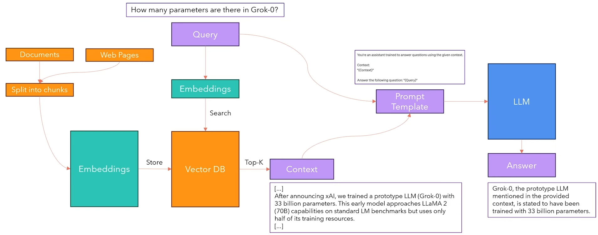
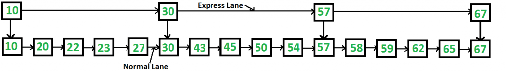
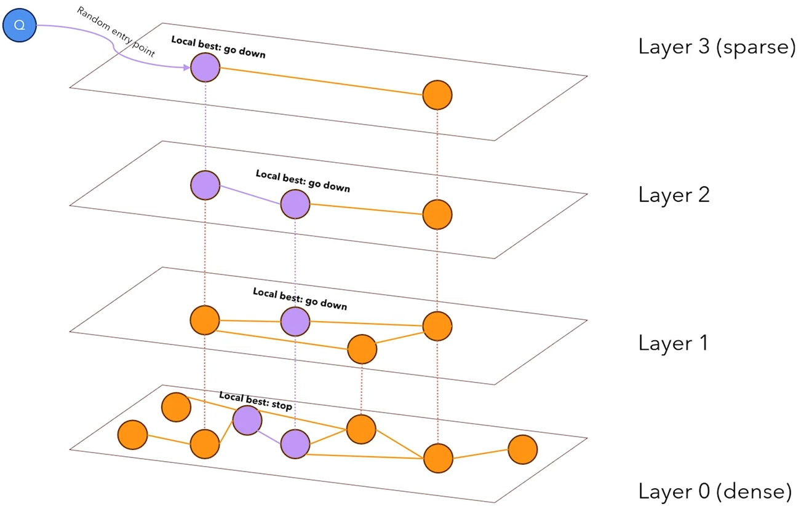

# Retrieval Augmented Generation - RAG
[^1] [^2] [^3]We can think of it in a way that we add context to the question/prompt we ask the model e.g.

```
Can you tell me about the train?

Context:
The shinkansen in english is called the bullet train ...
```


## RAG pipeline
1. We split given documents e.g. web pages or .pdf files so that we get an embedding that stores the information of the text. All the calculated values are then stored in a vector database.

2. Then for a query we also calculate the embedding and we can compare the new embedding with the vector database, so we get context and also metadata about the context.

3. Finally we pass the query and the context for the LLM to answer.

Actually we do prompt engineering to give the model context.

### Vector database
We use vectors insead of just words or tokens as by principle the vectors are supposed to represent the semantics of each word/sentence and we can use for instance cosine similarity to compare the similarity between words/sentences.

$\text{cosine similarity}(A,B) = \frac{<A,B>}{|A|\cdot |B|}$

For that purpose we can use BERT, we train it on MLM - masked language modelling to get an embedding of the input.

```
INPUT: Rome is the _ of Italiy
EXPECTED OUTPUT: Rome is the capital of Italy
WHAT BERT SHOULD OUTPUT: capital
```
### Sentence embedding
We can get the embedding of a sentence by feeding it through BERT (transformer decoder and averaging the results across the sequence dimention) e.g.

```
I am Mike -> |BERT| -> [0.3, 0.17, 1.3] -ave-> 0.59
```

In this naive example 0.59 is the representation of the sentence, obviously we do not need to limit ourselves to only 1 dimentional embedding.

Great, but BERT wasn't trained to make similar sentences in meaning, similar in their embeddings, because of that [^4]Sentence BERT is used

#### Sentence BERT
Imagine two sentences with pretty much the same semantic meaning
```
1: I love to eat
2: I enjoy eating
```
We encode them to get the sentence embeddings
```
1: I love to eat -> [0.5, 0.3, 1.4, 0.7] -ave-> [0.62]
2: I enjoy eating -> [0.5, 0.5, 1.2, pad] -ave-> [0.65]
```
then we calculate the cosine similarity and on that we can calculate the loss as e.g. MSE between cosine similarity and a target similarity e.g. 1 as the sentences have pretty much the same meaning, finally we can update the parameters.

For sentences that are not similar e.g.
```
1: I love to eat -> [0.5, 0.3, 1.4, 0.7] -ave-> [0.62]
2: I hate eating -> [0.5, -0.5, 1.2, pad] -ave-> [0.4]
```
We will want their cosine similarity to be as close to 0 (or -1) as possible.

We can average the sentence embedding across the sequence embedding or use the [[CLS]](../README.md) token, but in the [^4]paper they say that mean pooling (the first approach) works better than the [CLS] approach. And also in "production" the first is more common.

### Retrieveing data from Vector DB
Based on the calculated embeddings in the vector db we can select top k best matching contexts for a given query.

A naive approach would be to compare the query to all the vector database items in terms of cosine similarity etc. however this is very slow for big databases.

The database may use a variant of KNN to search for similar data to our query.

### Hierarchical Navigable Small Worlds - HNSW
With [^5]HNSW we trade accuracy for speed, metric that we usually care about in RAG is $recall = \frac{TP}{TP+FN}$. HNSW is actually used in [Qdrant](https://qdrant.tech/documentation/concepts/indexing/)

HNSW is based on the idea of six degrees of separation - it takes 6 intermediate people to send a letter from the person A to the person B given they do not know each other directly.

**Fun fact** [in 2016 Facebook (now Meta) wrote an article that says that on average on Facebook the average degree of separation between the users is 3.5](https://research.facebook.com/blog/2016/2/three-and-a-half-degrees-of-separation/)

HNSW similarly builds a graph on all the connections, but with maximum number of conections at each node limited to e.g. 6
1. We find an entry point randomly and compare its similarty with the query
2. If one of the nodes connected to the first one has a better similarity than the other that is also connected to the first one we move towards it.
3. And so so untill there are no neighbours to the current node that have a better similarity to the query.
4. Based on the traversed path we can choose the vectors with the best similarity to the query.

We can repeat the algorithm n times and keep the top k vectors, in order to add a vector to the graph we do the same thing as with searching, we just connect the new node with its top k similar nodes.



Aditionally we introduce a [skip list](https://www.geeksforgeeks.org/dsa/skip-list/), which is something that we can think of as a hierarchy of connections e.g. at the lowest level all the nodes are connected with each other but on the highest only the "important" nodes are connected and the rest is not available.

So with a query we first visit the highest level and get the best nodes, then so on with all the lower levels, but insteaad of starting from a random entry point at each level we use the nodes that on the higher level were considered as locally the best.



We repeat it n times for different entry points and we select the top k.

## Disclaimer
> [!CAUTION]
> This repo does not serve to amazingly describe and explain model architectures, it was made to give a broad simplified overview of the models and implement them.

[^1]: Lewis, P., Perez, E., Piktus, A., Petroni, F., Karpukhin, V., Goyal, N., Küttler, H., Lewis, M., Yih, W., Rocktäschel, T., Riedel, S., & Kiela, D. (2020). Retrieval-Augmented Generation for Knowledge-Intensive NLP tasks. arXiv (Cornell University). https://doi.org/10.48550/arxiv.2005.11401

[^2]: Umar J. (2023). Retrieval Augmented Generation (RAG) Explained: Embedding, Sentence BERT, Vector Database (HNSW). https://www.youtube.com/watch?v=rhZgXNdhWDY&ab_channel=UmarJamil

[^3]: LangChain RAG Tutorial. https://python.langchain.com/docs/tutorials/rag/

[^4]: Reimers, N., & Gurevych, I. (2019). Sentence-BERT: Sentence Embeddings using Siamese BERT-Networks. arXiv (Cornell University). https://doi.org/10.48550/arxiv.1908.10084

[^5]: Pinecone Hierarchical Navigable Small Worlds (HNSW). https://www.pinecone.io/learn/series/faiss/hnsw/