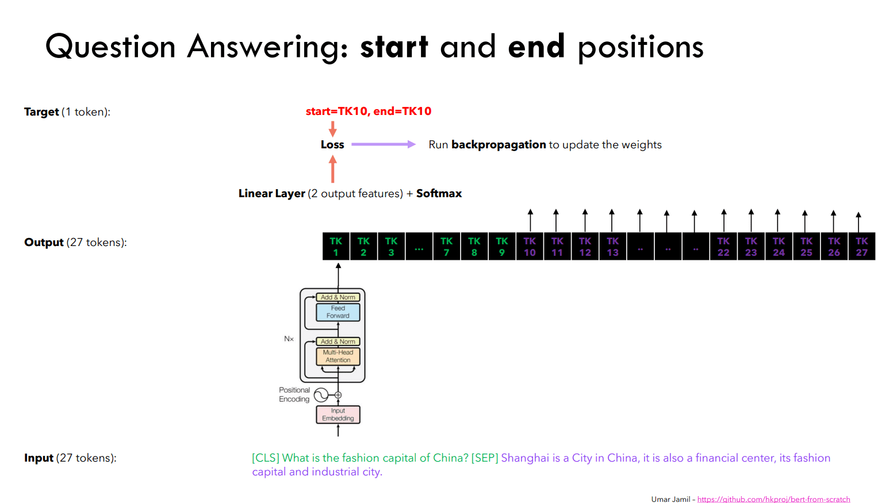

# BERT: Pre-training of Deep Bidirectional Transformers for Language Understanding

## What is BERT
[^1] BERT stands for Bidirectional Encoder Representations from transformers

BERT is a language representation model, which means that [^2]:
- Unlike LLMs it does not handle "special tasks", instead it can be specialized by finetuning
- unlike LLMs it has been trained on the left and right context - meaning that we don't apply any mask in attention layers, thus we learn the whole sentence context (loosely speaking) - this refers to the bidirectionality of the model
- Unlike LLMs BERT is not built for generating text
- Unlike LLMs BERT was not trained on next token prediction, instead it used masked language model (MLM) and next sentence prediction (NS)

BERT is designed to pre-train deep bidirectional representations from unlabeled text, and can be finetuned with just one additional output layer. A distinct feature of BERT is its unified architecture across different tasks. BERT is pretrained on two unsupervised tasks.

The first token of every sequence is always $[CLS]$ - classification token. The final hidden state of this token is used as the aggregate of the sequence's meaning/representation for classification tasks. For tasks requiring the use of the sentences, the sentences are concatened with a $[SEP]$ token between them, and additional embedding is used to differentiate to which sentence the concatenated pair element belongs to (it will be more clear with an [example](#next-sentence-prediction-pretraining---step-2)).

### Architecture overview
Model architecture consists of bidirectional (no mask for attention) transformer encoders.

<p align="center">
  
</p>

<div align='center'>
<em>Fig.1 BERT - architecture overview [1]</em>
</div>

### Masked Language Model pretraining - step 1
We mask random sentence words and expect the model to predict them e.g.
```
The [mask] of Germany is Berlin

expected model output = capital
```
The original paper describes that they masked 15% of WorPiece tokens in each sentence at random, we only predict the masked word rather than the whole sentence. This allows to obtain a bidirectional pre-trained model but in the model that will be finally used there will be no $[mask]$ token, that's why they also for some sentences randomly switched words e.g. capital $\rightarrow$ zoo, and for some sentences nothing was changed.

Step by step MLM:
1. We select 15% of token positions at random for prediction
    - in 80% of cases we replace a sentence token with a $[mask]$ token
    - in 10% of cases we replace a sentence token with a random token
    - in 10% of cases we don't apply any changes

2. The model is expected to predicted the original token, that is then compared through cross entrophy

In this task we use stacked encoders to find the sentence's numerical representation and then we process it with a linear layer that gives us the output $\sim(vocab\_ size)$ and after softmax we can get the word probabilities and we can compare it with the label (original token), calculate Cross Entrophy loss and update model parameters based on that.

<p align="center">
  
</p>

<div align='center'>
<em>Fig.2 BERT - MLM training overview (we get all tokens but we compare the proper one with label in the figure) [2]</em>
</div>

### Next Sentence prediction pretraining - step 2
Many important downstream tasks like Question Answering (QA) and Natural Language Inference (NLI) are based on understanding the relationship between sentences. For the Next Sentence prediction task we choose two sentences: sentence A and sentence B so that 50% of the time sentence A procedes sentence B (A $\rightarrow$ B) and for 50% of the time sentence A doesn't proceed sentence B (A $\nrightarrow$ B) e.g. _A $\rightarrow$ B - I like cats. The cats are nice._ OR _A $\nrightarrow$ B - I like cats. The enemies are inbound._

<p align="center">
  
</p>

<div align='center'>
<em>Fig.3 BERT - final embeddings explained [1]</em>
</div></br>

In this case we have two sentences but our model requires one input, thats why we concatenate the sentences like: sentence A + [SEP] + sentence B, and add the so-called "sentence embeding". Then we feed them through the stacked encoders, and we use only the first token $[CLS]$ of the sentence representation to predict whether or not the sentenecs proceed each other with a linear(in_size=$d_{model}$, out_size=1 (or 2) ), we can apply softmax and calculate loss with Cross Entrophy and update model parameters.

Since we don't use any mask the $[CLS]$ token captures the "meaning" of the whole concatenated sequence.

<p align="center">
  
</p>

<div align='center'>
<em>Fig.4 BERT - NS training overview (we use only the first token) [2]</em>
</div>

### BERT fine-tuning
BERT can be finetuned for almost any language-specific task.

#### Text classification
In the similar manner as [here](#next-sentence-prediction-pretraining---step-2) we can finetune BERT for text classification. We will use the first token of the sentence representation $[CLS]$ and a linear(in_size=$d_{model}$, out_size=n_classes) to calculate class probabilities with softmax and proceed same as in Next Sentence prediction.

<p align="center">
  
</p>

<div align='center'>
<em>Fig.5 BERT - text classification finetuning overview (we use only the first token) [2]</em>
</div>

#### Question Answering (QA)
Suppose we have given data:

Context: "France is the fashion capital of the world, the capital of which is Paris"

Question: "What is the capital of France?"

(Answer in the context) indices: start=14 (Paris), end=14 (Paris) (here the answer is one word,  but it may not be)

We can utilize a similar logic presented [here](#masked-language-model-pretraining---step-1), but instead of predicting the probability of the masked word we calculate the probability of a word being either of start or the end of the answer. Namely we pass the concatenated Question and Context through the encoder stack, then for each token we can calculate the probability of it being either the start or the end of the expected (taken from context) answer.

<p align="center">
  
</p>

<div align='center'>
<em>Fig.6 BERT - QA finetuning overview [2]</em>
</div>


## Disclaimer
> [!CAUTION]
> This repo does not serve to amazingly describe and explain model architectures, it was made to give a broad simplified overview of the models and implement them.

[^1]: Devlin, J., Chang, M., Lee, K., & Toutanova, K. (2018). BERT: Pre-training of Deep Bidirectional Transformers for Language Understanding. arXiv (Cornell University). https://doi.org/10.48550/arxiv.1810.04805

[^2]: Umar J. (2023). BERT explained: Training, Inference, BERT vs GPT/LLamA, Fine tuning, CLS token. https://www.youtube.com/watch?v=90mGPxR2GgY&ab_channel=UmarJamil