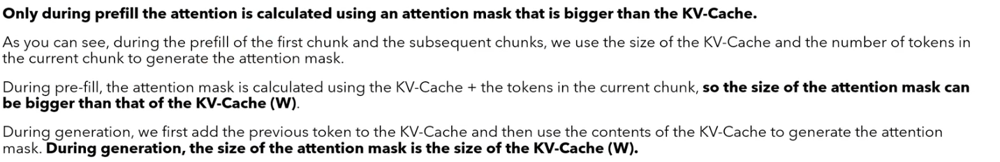

# Mistral
Mistral is a French startup, founded in 2023 that specializes in making LLMs. The first paper that Mistal released is Mistral 7B, describing the model they released of the same name.
## Architecture overview
Mistral has multiple key elements in its architecture, with context length of 8k
### Attention
Mistral uses sliding window attention with a rolling buffer KV cache. It also uses [GQA](../README.md).
### Feed Forward
Uses just SiLU function, but also uses MoE - Misture of Experts.

## Architecture details
### Sliding window attention
Obviously as Mistral is a decoder only model we need the attention to be causal, what is new is that we apply additionally a mask thats cuts off some of the values below the diagonal with a given offset - in effect words are just related to only few of their predecessors, thus less dot product calculations. Obviously this shriks the local context (smaller receptive field) for each word, but e.g. if you watch the whole Lord of the Rings series you do not necessarily care about the relation of the first 15 minutes of the first movie with the last 15 minutes of the movie, as they are around 12h apart.


However now each embedding captures the information of previous n tokens like


So in total after n layers each embedding captures information about the previous k tokens, just like in CNNs - their receptive field grows with each layer. For sliding window size of n after each layer we add information for each embedding about the previour k = k+(n-1) tokens (generally speaking).

### KV Cache with rolling buffer cache
Regular KV cache looks like


Since we are using the sliding window attention. We don't need all K and V values, we can limit it to only n previous tokens, with n being the window size.


```python
window_size = 3 (cache size)

time_step:1 -> cache = [<SOS>]
time_step:2 -> cache = [<SOS>I]
time_step:3 -> cache = [<SOS>I am]
time_step:4 -> cache = [I am Anthony]
...
```
### Pre-filling and chunking
In KV cache we calculate the attention for Q~(1,dim) and K,V of sizes~(seq_len,dim), this is good but if we have a user prompt that is very long this is quite wasteful to go token by token as we already know what the prompt is and we won't be generating anything anyway.

#### Pre-filling
Instead imagine our windows size is 16 and user prompt is 8 in length, what we do is we use the whole prompt to calculate the attention~(8,8) (as its length is smaller then the window size) and then we generate a new token, and with this new token we come back to vanilla KV cache with rolling buffer, so we calculate the next attention matrices with Q~(1,dim) (being the last generated token) and K,V~(sliding_window,dim) (being the last sliding_window-number of tokens), so we get attention of size~(1,sliding_window).

#### Chunking

But what is the users prompt is bigger then the sliding window e.g. sliding window is of size 16 and prompt is of size 34. We divide the prompt into chunks.
1. First we calculate the attention same as in prefilling, however we fill the whole window, so our attention is of size~(sliding_window, sliding_window), we keep the K,V values in cache (remember that for each layer and each iteration they will change).


2. Then we calculate attention matrix with next chunk but we also use the cached K,V values, so our attention is of size~(sliding_window, 2*sliding_window), we cache the K,V values for the last sliding_window-number of tokens that were in the new chunk.


3. Finally we are left with 2 tokens from the prompt, so we use them together with the ones stored in the KV cache so our attention is~(2, sliding_window + 2).


4. After that when we generate we come back to vanilla KV cache with rolling buffer.