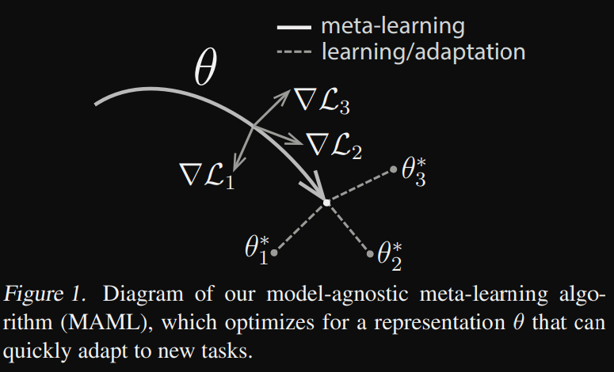
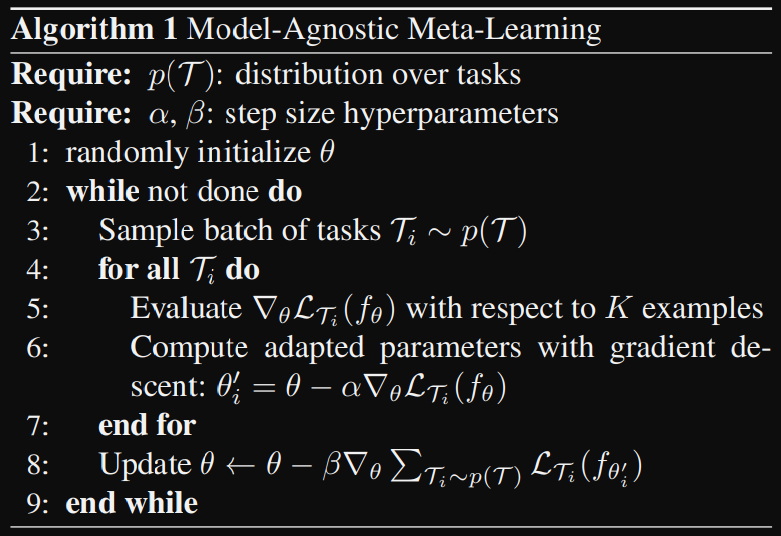
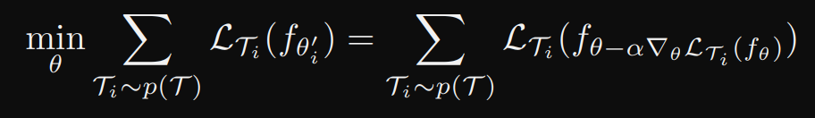
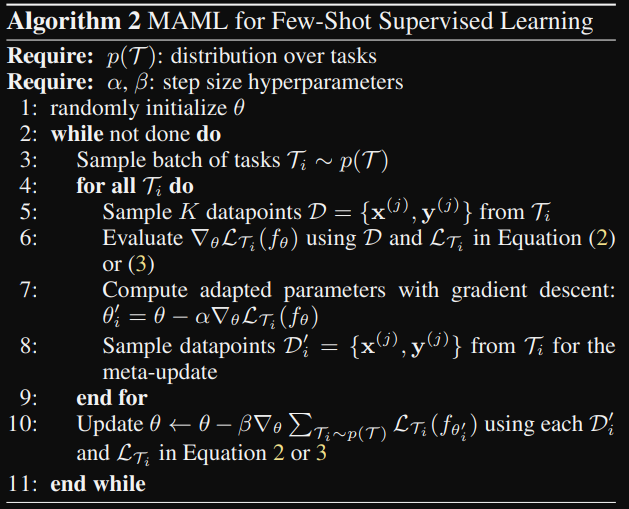
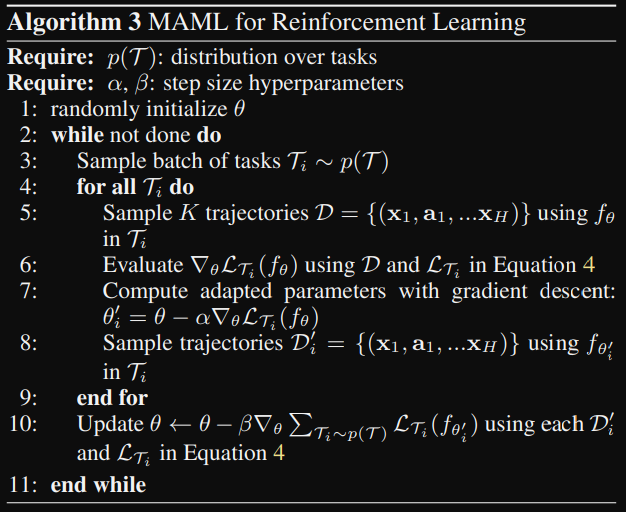
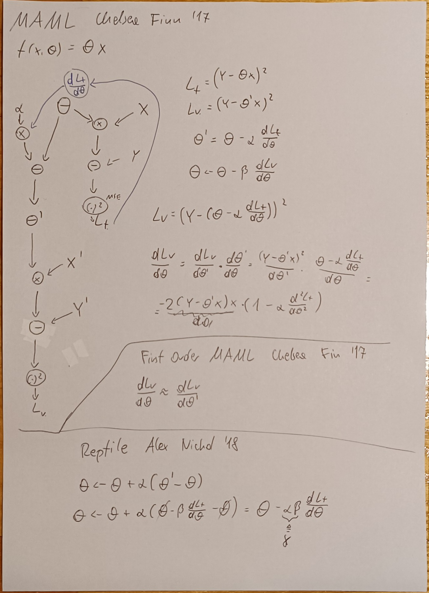
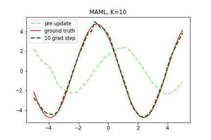

### MAML — Model-Agnostic Meta-Learning for Fast Adaptation of Deep Networks
The goal of meta-learning ("learning to learn") is to train a model on a variety of different tasks, such that it can solve a new learning tasks using only a small number of training examples. The model is easily fine-tuned, it is achieved when the internal representation is suitable to many tasks, hence fine-tuning can produce good results with a minimal number of iterations. This can be viewed as maximizing the sensitivity  of the loss function of new tasks with respect to the parameters (high sensivity = small changes to the parameters can lead to huge improvements in the task loss).



During traing the model is trained to be able to adapt to a large or infinite number of tasks. Formally each task: $T = \lbrace L(x_1, a_1, ..., x_H, a_H), q(x_1), q(x_{t+1}|x_t,a_t),H \rbrace$

$L$ - loss

$q(x_1)$ - distribution over initial observations

$q(x_{t+1}|x_t,a_t)$ - transition distribution

$H$ - episode length (in i.i.d supervised learning problems $H=1$)

The model may generate samples of length $H$ by choosing an output $a_t$ at each time $t$. the loss provides a task-specific feedback, which might be in a form of a misclassification loss or a cost function in a Markov decision process. In the paper they consider a distribution over tasks $p(T)$. In the K-shot learning setting the model is trained to learn a new task $T_i$ drawn from $p(T)$ from K samples drawn from $q_i$ and feedback $L_{T_i}$ is generated. During meta-training a task $T_i$ is sampled, the model is trained with K samples based on the loss $L$, and then the model is tested on new samples from $T_i$ and improved based on the test error on new data from $q_i$. In effect the test error serves as the training error of the meta-learning process. At the end of meta-training, new tasks are sampled from $p(T)$ and meta-performance is measured by the model's performance after learning from K samples. Generally tasks used for meta-testing are held out during meta-training.





#### Supervised regression and classification
We define $H=1$, we calculate the loss of task $T_i$ for K examples, then we calculate the desired loss function e.g. MSE or CEL



#### Reinforcement learning
The goal for meta-learning is to quickly acquire a policy for a new task. Each RL task $T_i$ is a Markov Decision process (MDP) with horizon H. Since the reward is usually not differentiable, they used policy gradient method to estimate the gradient



#### Intuition
[MAML explanation](https://interactive-maml.github.io/maml.html)

When training a generic model to do some task on a small dataset, it will perform poorly due to the lack of data. MAML works in a way that it learns to solve multiple similar tasks, to incorporate this we assume that out task $T$ comes from a distribution $p(T)$ and that we can sample from this distribution. Eventually we want to use the data from other to converge to a specific task $T_i \sim p(T)$. T is a random variable and $\theta _{T}$ is a set of params for the task $T$. We won't simply use the data from all the tasks to find the parameters that are optimal for all tasks, thus we can express the objective as $\displaystyle \min _{x}E_T[L_T(U_T(\theta))]$ where $U_T(\theta)$ is the fine-tuned $\theta$ on the task $T$ by using the optmizer $U$.

In conventional ML $\theta$ are model parameters, however here it is learnt to a variety of tasks, meaningn $\theta$ can be regarded as the initialization of the optimizer $U_T$, therefore $\theta$ is above task-level and can be regarded as a meta-parameter, optimizing this meta-parameters is called meta-learning.

Let's add a superscript to $U$ denoting the number of $m$ gradient steps: $U_T^{(m)}(\theta)$. MAML optimizes through the $U_T^{(m)}(\theta)$ as $\displaystyle \min _{x}E_T[L_T(U_T^{(m)}(\theta))]$

##### Algorithm overview
  1. Sample a task $T_i$ form $p(T)$
  2. For each task calculate $\theta _{T_i}' = U_{T_i}^{(m)}(\theta)$ by minimizing $L_{T_I, train}(\theta)$
  3. Update $\theta$ by gradient descent such that it minimizes $L(\theta) = \sum\nolimits_i L_{T_i, test}(\theta _{T_i}')$

The easiest way to get $\theta _{T_i}'$ is to calculate (single step gradient descent)

$\theta _{T_i}' = \theta - \alpha \nabla _{\theta} L_{T_i, test}(\theta)$

Updating $\theta$ requires us to evaluate the gradient across all individual tasks

$\nabla _{\theta}L(\theta) = \sum\nolimits _iL_{T_i, test}(\theta _{T_i}')$

$\theta _{T_i}' = U_{T_i}(\theta)$ depends on $\theta$, so we have to take a gradient through the optimizer $U$, we can then update $\theta$  using a learning rate $\beta$

$\theta \leftarrow \theta - \beta \nabla _{\theta}L(\theta)$
#### MAML on paper


#### Implementataion
MAML

$\theta \leftarrow \theta - \beta \cdot \frac{dL_v}{d \theta}$
```python
for e in range(epochs):
    for x, b in tasks:
        x_train = x[:int(n_data*0.3)]
        y_train = get_y(x_train, b)

        x_valid = x[int(n_data*0.3):]
        y_valid = get_y(x_valid, b)

        loss = torch.nn.functional.mse_loss(linear(x_train, theta), y_train) # calculate task specific loss
        grad = torch.autograd.grad(loss, theta, create_graph = True)[0] # get the gradient, keep it as a node
        
        theta_prime = theta - 0.1*grad # create theta_prime as a node

        loss_outer = torch.nn.functional.mse_loss(linear(x_valid, theta_prime), y_valid) # calculate validation loss
        
        meta_grad = torch.autograd.grad(loss_outer, theta)[0] # calculate the validation loss over theta

        with torch.no_grad(): # here we use no_grad() so theta doesn't get kept in a weird multi layer graph
            theta -= 0.1*meta_grad
```
First Order MAML

$\theta \leftarrow \theta - \beta \cdot \frac{dL_v}{d \theta_{prime}}$
```python
for e in range(epochs):
    for x, b in tasks:
        x_train = x[:int(n_data*0.3)]
        y_train = get_y(x_train, b)

        x_valid = x[int(n_data*0.3):]
        y_valid = get_y(x_valid, b)

        loss = torch.nn.functional.mse_loss(linear(x_train, theta), y_train)
        grad = torch.autograd.grad(loss, theta, create_graph = False)[0] # we don't include the gradient as a node
        
        theta_prime = theta - 0.1*grad

        loss_outer = torch.nn.functional.mse_loss(linear(x_valid, theta_prime), y_valid)
        
        meta_grad = torch.autograd.grad(loss_outer, theta_prime)[0] # we just differentiate over theta prime

        with torch.no_grad():
            theta -= 0.1*meta_grad
```
[Reptile](https://arxiv.org/pdf/1803.02999)

$\theta \leftarrow \theta + \beta \cdot (\theta' - \theta)$
```python

for e in range(epochs):
    for x, b in tasks:
        x_train = x[:int(n_data*0.3)]
        y_train = get_y(x_train, b)

        x_valid = x[int(n_data*0.3):]
        y_valid = get_y(x_valid, b)

        loss = torch.nn.functional.mse_loss(linear(x_train, theta), y_train)
        grad = torch.autograd.grad(loss, theta, create_graph = False)[0] # we dont include the gradient as a node
        
        theta_prime = theta - 0.1*grad

        with torch.no_grad():
            theta += 0.1*(theta_prime - theta) # we don't calculate any additional gradient, we just update theta with theta prime
            loss_outer = loss = torch.nn.functional.mse_loss(linear(x_train, theta), y_train)

```

##### Papers in 1000 lines of Code
[Papers in 1000 lines of Code](https://github.com/MaximeVandegar/Papers-in-100-Lines-of-Code/blob/main/Model_Agnostic_Meta_Learning_for_Fast_Adaptation_of_Deep_Networks/maml.py#L24)

```python
import torch
import torch.nn as nn
import numpy as np
from tqdm import tqdm
import matplotlib.pyplot as plt
from torch.autograd import grad
```
Define MLP (functionally pretty much same as a class(nn.Module))
```python
def mlp(x, params):
    h = torch.relu(torch.nn.functional.linear(x, params[0], bias=params[1]))
    h = torch.relu(torch.nn.functional.linear(h, params[2], bias=params[3]))
    return torch.nn.functional.linear(h, params[4], bias=params[5])

```
Synthesize a task - here sin prediciton
```python
class Task:
    def __init__(self, a, b):
        self.a = a
        self.b = b

    def sample(self, K):
        x = torch.rand((K, 1)) * 10 - 5  # Sample x in [-5, 5]
        y = self.a * torch.sin(x + self.b)
        loss_fct = nn.MSELoss()
        return x, y, loss_fct

@torch.no_grad()
def sample_task():
    a = torch.rand(1).item() * 4.9 + .1  # Sample the amplitude in [0.1, 5.0]
    b = torch.rand(1).item() * np.pi  # Sample the phase in [0, pi]
    return Task(a, b)
```
The 'inner' task loop to get $\theta _{T_i}'$
```python
def perform_k_training_steps(params, task, batch_size, inner_training_steps, alpha, device='cpu'):
    for epoch in range(inner_training_steps):
        x_batch, target, loss_fct = task.sample(batch_size)
        loss = loss_fct(mlp(x_batch.to(device), params), target.to(device))

        for p in params:  # Zero grad
            p.grad = None
        gradients = grad(loss, params)
        for p, g in zip(params, gradients):  # Grad step
            p.data -= alpha * g
    return params
```
MAML 'outer' training
```python
def maml(p_model, meta_optimizer, inner_training_steps, nb_epochs, batch_size_K, alpha, nb_tasks=10, device='cpu'):
    """
    Algorithm from https://arxiv.org/pdf/1703.03400v3.pdf (MAML for Few-Shot Supervised Learning)
    """
    training_loss = []
    for epoch in tqdm(range(nb_epochs)):  # Line 2 in the pseudocode

        theta_i_prime = []
        D_i_prime = []

        # Sample batch of tasks
        tasks = [sample_task() for _ in range(nb_tasks)]  # Line 3 in the pseudocode - sample tasks
        for task in tasks:
            theta_i_prime.append(perform_k_training_steps([p.clone() for p in p_model], task, batch_size_K,
                                                          inner_training_steps, alpha, device=device)) # line 7 of the pseudocode - calculate the theta' for a task
            # Sample data points Di' for the meta-update (line 8 in the pseudocode - sample the 'test' data)
            x, y, loss_fct = task.sample(25)
            D_i_prime.append((x, y, loss_fct))

        # Meta update
        meta_optimizer.zero_grad()
        batch_training_loss = []
        for i in range(nb_tasks):
            x, y, loss_fct = D_i_prime[i]
            f_theta_prime = theta_i_prime[i]
            # Compute \nabla_theta L(f_theta_i_prime) for task ti
            loss = loss_fct(mlp(x.to(device), f_theta_prime), y.to(device))
            loss.backward()
            batch_training_loss.append(loss.item())

        meta_optimizer.step()  # Line 10 in the pseudocode - update the original params based on the theta' of the task
        training_loss.append(np.mean(batch_training_loss))
    return training_loss
```
Full MAML training
```python
device = 'cuda'
params = [torch.rand(40, 1, device=device).uniform_(-np.sqrt(6. / 41), np.sqrt(6. / 41)).requires_grad_(),
          torch.zeros(40, device=device).requires_grad_(),
          torch.rand(40, 40, device=device).uniform_(-np.sqrt(6. / 80), np.sqrt(6. / 80)).requires_grad_(),
          torch.zeros(40, device=device).requires_grad_(),
          torch.rand(1, 40, device=device).uniform_(-np.sqrt(6. / 41), np.sqrt(6. / 41)).requires_grad_(),
          torch.zeros(1, device=device).requires_grad_()]

device = 'cuda'
meta_optimizer = torch.optim.Adam(params, lr=1e-3)
training_loss = maml(params, meta_optimizer, 1, 70_000, 10, 1e-3, device=device, nb_tasks=10)

plt.title('MAML, K=10')
x = torch.linspace(-5, 5, 50).to(device)
y = mlp(x[..., None], params)
plt.plot(x.data.cpu().numpy(), y.data.cpu().numpy(), c='lightgreen', linestyle='--', linewidth=2.2,
          label='pre-update')
# New task
task = sample_task()
ground_truth_y = task.a * torch.sin(x + task.b)
plt.plot(x.data.cpu().numpy(), ground_truth_y.data.cpu().numpy(), c='red', label='ground truth')
# Fine-tuning, 10 gradient steps
new_params = perform_k_training_steps([p.clone() for p in params], task, 10, 10, 1e-3, device=device)
# After 10 gradient steps
y = mlp(x[..., None], new_params)
plt.plot(x.data.cpu().numpy(), y.data.cpu().numpy(), c='darkgreen', linestyle='--', linewidth=2.2,
          label='10 grad step')
plt.legend()
plt.savefig('maml.png')
plt.show()
```



MAML training - "pre-update" is the general model, "10 grad step" is after 10 steps of fine-tuning for a specific task
