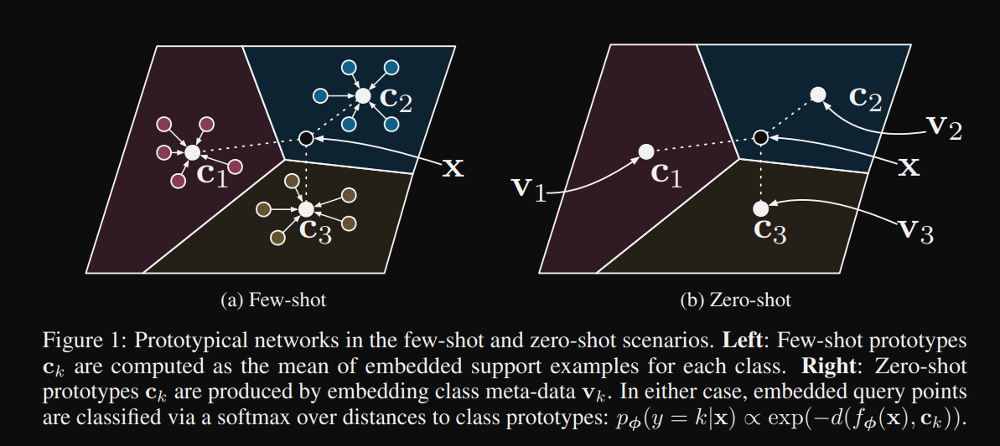
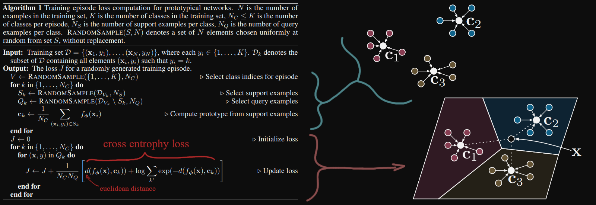
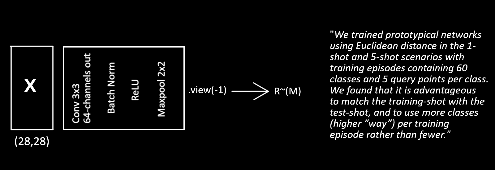
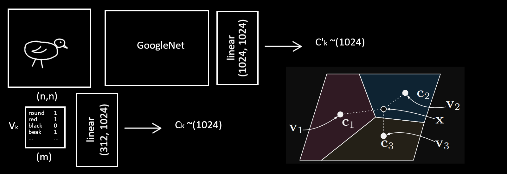

### Prototypical Networks for Few-shot Learning
Prototypical networks were introduced for small datasets with few-shot learning. the idea is that there exists an embedding in which points cluster around a single prototype representation for each class (cluster around a point) $f_{\theta}:R^D \rightarrow R^M$ (input~(D), embedding~(M)).

The classe's prototype is the mean of its "support set" in the embedded space. Classification is done as finding the nearest class prototype for a given query point.

#### Few-shot

#### Zero-shot

The $C_k$ class prototype is achieved by projecting the attribute vector $V_k$ into the space and normalizing it $C_k = \frac{C_k}{||C_k||}$, we then try to project the image $C'_k$ into the same place as $C_k$