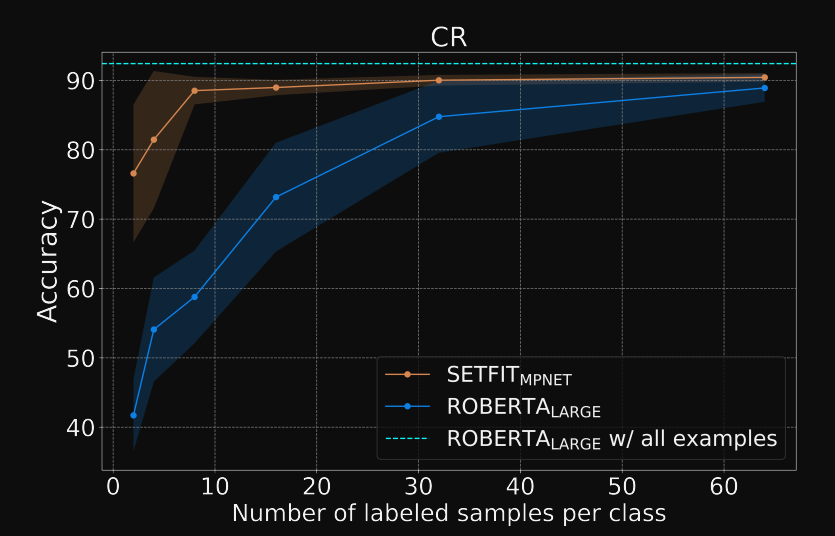
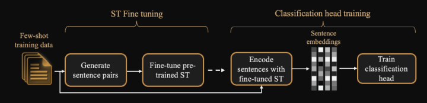
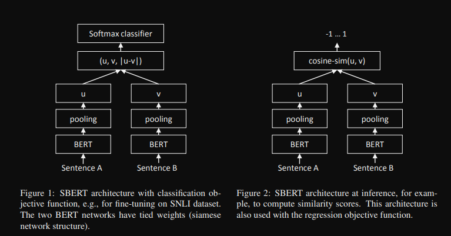

### SetFit
[Hugging Face - SetFit: Efficient Few-Shot Learning Without Prompts](https://huggingface.co/blog/setfit)

[Efficient Few-Shot Learning Without Prompts](https://arxiv.org/pdf/2209.11055)

[github](https://github.com/huggingface/setfit)

[HF hub](https://huggingface.co/SetFit)

*SetFit is significantly more efficient and robust to noise than standars fine-tuning*
#### Key points
- high accuracy with little labeled data
- no prompts - just embeddings
- fast to train
- multilingual

#### How does it work?
SetFit - Sentence Transformer Finetuning

We finetune a pretrained Sentence transformer (ST - contrastive_loss(BERT_like(sent1), BERT_like(sent2))) on a small number of samples - text pairs in a "contrastive siamese manner". We use the model to generate embeddings and use them to train a classifier.

##### First training step
Contrastive learning with a concatenation of a set of "positive triplets" $T^c_p = \lbrace(x_i, x_j, 1)\rbrace$ where $x_i$ and $x_j$ are a pair comming from the same class $c$ and a set of "negative triplets" $T^c_n = \lbrace(x_i, x_j, 0)\rbrace$ where $x_i$ and $x_j$ are comming randomly from different classes $c_i \neq c_j$. The size of the dataset $\sim (n(n-1)/2)$ is significantly larger than the original data $\sim (n)$

##### Second training step
Classification head training.

We use the finetuned ST giving sentence embeddings and we train a classificaton head on $T^{CH} = \lbrace(ST(x_i), y_i)\rbrace$

##### Inference

Obvious same process as training.