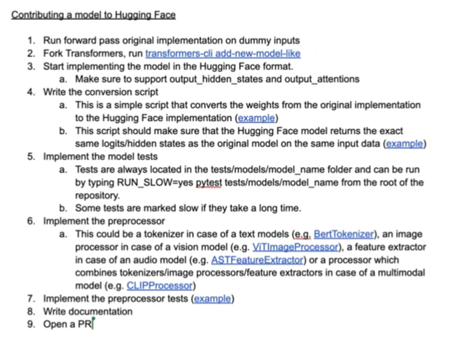

> [!NOTE]  
> Huge thanks to [Niels Rogge](https://www.youtube.com/@NielsRogge) for making a tutorial for HF transformers library contribution

## 1. Compare our implementation with the origin al one to make sure it is correct (if we want to create a model based on another repo e.g. `facebook/dinov2`)
e.g. we want to create a dino model so we compare the loggits / hidden states between our implementation and the original one.

