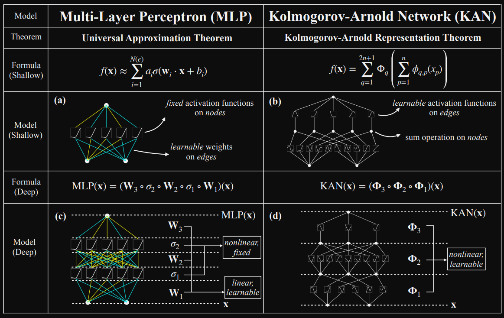
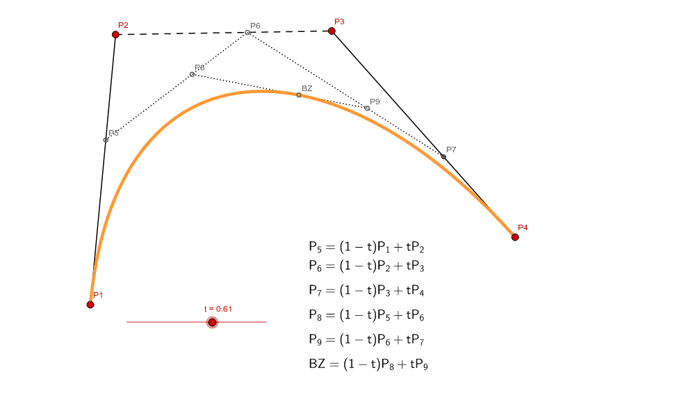
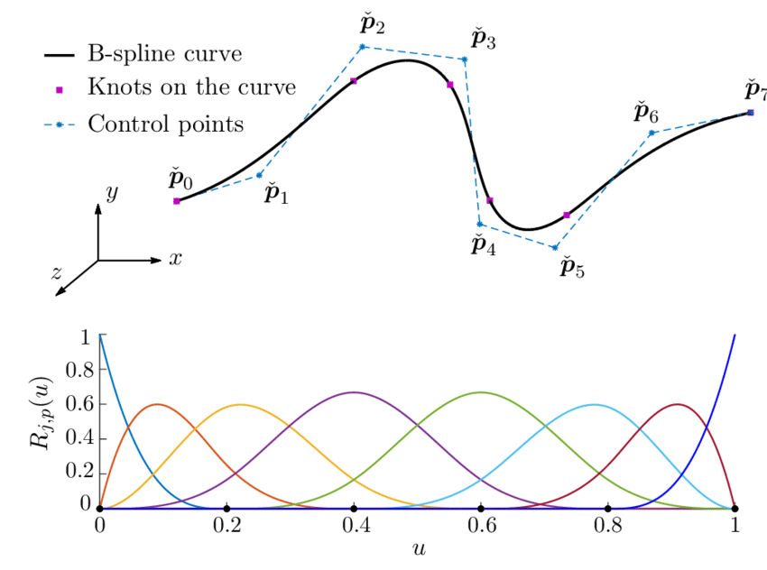
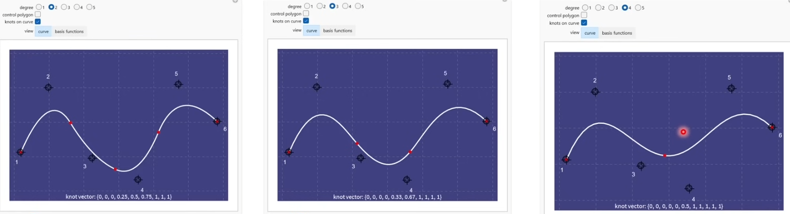
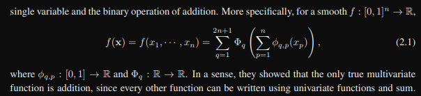
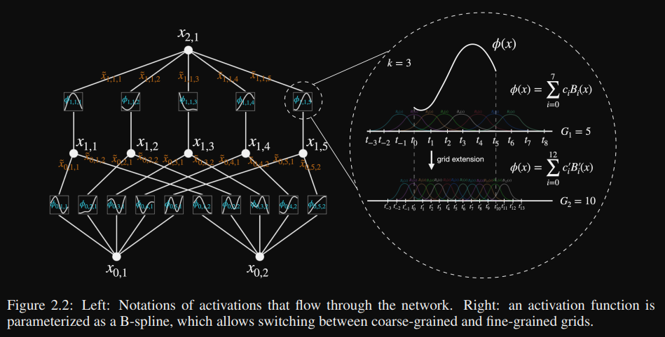
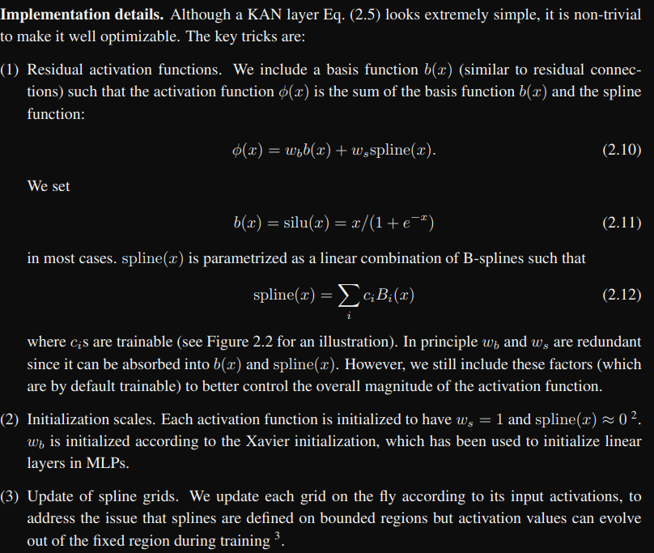
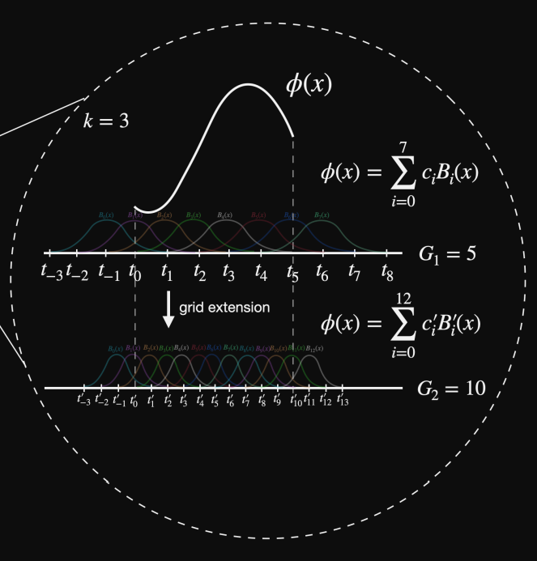
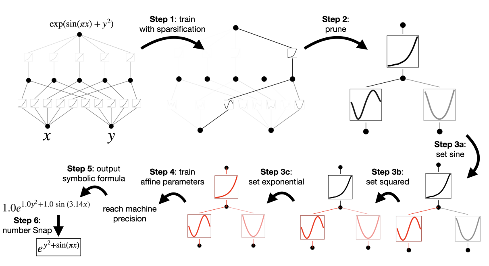
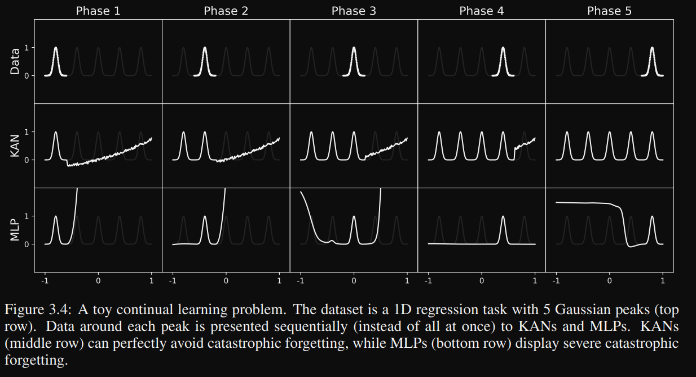

# Kolmogorov-Arnold Networks (KAN)

[^1] [^2] MLPs are made up of linear learnable transformations with fixed non-linearities, such as ReLU. KANs just have non-linear layers. 

## Bezier curve
Bezier curve is a parametric curve

It is parametric in sense, that all coordinates of the curve depend on an independent variable t (between 0 and 1). We can think of t as time, and the curve as an "animation".

$B(t) = P_o + t(P_{1} - P_o)$

We can extend it to multiple points e.g.

### Bernstein basis polynominal
We can get the equation of the Bezier curve without having to calculate it recursively.

$B(t) = \sum_{i}^{n} \binom{n}{i}(1-t)^{n-i}t^kP_i = \sum_{i}^nb_{i,n}(t)P_i$

$\binom{n}{i} = \frac{n!}{i!(n-i)!}$ is the binominal coefficient

## B-spline
We stitch together multiple Bezier curves. We connect them at the ends, the points where they meet are colled knots.

For $n$ knots, we can construct a B-spline of degree $k$. For example, with $6$ knots, we may choose a B-spline of degree $2$, which corresponds to $4$ (i.e., $3 + 1$) quadratic Bézier curve segments, and so on.

An order-$k$ B-spline is formed by joining several polynomial pieces of degree $k - 1$ with $C^{k-2}$ continuity at the knots. This means that the spline has continuous derivatives up to order $k - 2$.

### Example
Consider a cubic B-spline (order $k = 4$).  
Each piece of the spline is a polynomial of degree $p = k - 1 = 3$.  
The spline segments are joined with $C^{k-2} = C^2$ continuity, meaning that the first and second derivatives are continuous across the knots.

For instance if we divide a segment $m=6$-ways, and we define a uniform knot vector of $m+1$ number of knots:

$\mathbf{t} = [0, 1, 2, 3, 4, 5, 6]$

then the resulting cubic B-spline will consist of:

$n=m+1-k=6+1-4=3$

$(p=3)$ cubic polynomial segments. Spanning $k=4$ knots each: $[t_0, t_4], [t_1, t_5], [t_2, t_6]$ i.e. $(t_{i:i+4})$

This cubic B-spline is smooth up to the second derivative, unlike a simple piecewise cubic Bézier curve, which would only have $C^0$ continuity at the joins.

## KAN representation theorem
What it says is that we can aproximate any function (universal approximation theorem) if we structure our network like this:

where $n$ is the number of features. E.g. $n$ is 2, then $2n+1=5$ so $q$ will go from 1 to 5 and p form 1 to 2, so we have 10 functions in total:

$\varphi_{1,1} \quad \varphi_{2,1} \space ... \space \varphi_{5,2}$

from that we will get 5 features, that can get summed to 1.

$f(x) = \varphi_{1} + \varphi_{2} + \cdots + \varphi_{5}$ where $\varphi_{1} = \varphi_{1,1} + \varphi_{1,2}$

where $\varphi$ are learnable non-linearities.

## KAN learnable non-linearities

## KAN param count

KAN: $O(N^2L(G+K)) \approx O(N^2LG)$

$K$ order of the function (Bezier curve). Order is degree + 1, so k=3 means quadratic

$G$ is the "grid" (number of knots - meeting points of the curves, or just the number of intervals in our curve).

So for G=5 and k=3 we can say that we want to use quadratic bumps on some grid that was divided into 5 intervals (giving 6 knot points: $t_0 \cdots t_5$), and the functions in each interval may overflow to the other intervals.

MLP: $O(N^2L)$

KAN has also the advantage that for the same model architecture we can increase the number of params by increasing the number of control points / grid / intervals.

## Interpretability
KAN have great interpretability

We can tell exactly what curve is fitted to the data, which may be great if we want e.g. to tell why the model predicts some drug dose to a patient - which is not the case for MLPs.

## Catastriphic Forgetting and Locality
Because KANs have multiple knots we can only adjust one of them at the time, which is great because for continual learning tasks, such as learning polish and then english we can keep the learnt knowledge in the model's parameters. The locality enables the model to keep learning new things, without having to forget the previous knowledge.

## Disclaimer
> [!CAUTION]
> This repo does not serve to amazingly describe and explain model architectures, it was made to give a broad simplified overview of the models and implement them.

[^1]: Liu, Z., Wang, Y., Vaidya, S., Ruehle, F., Halverson, J., Soljačić, M., Hou, T. Y., & Tegmark, M. (2024). KAN: Kolmogorov-Arnold Networks. arXiv (Cornell University). https://doi.org/10.48550/arxiv.2404.19756

[^2]: Umar J. (2024). Kolmogorov-Arnold Networks: MLP vs KAN, Math, B-Splines, Universal Approximation Theorem. https://www.youtube.com/watch?v=-PFIkkwWdnM&t=28s