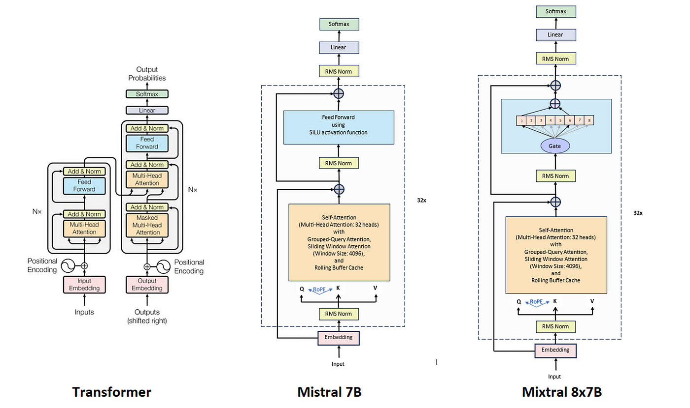
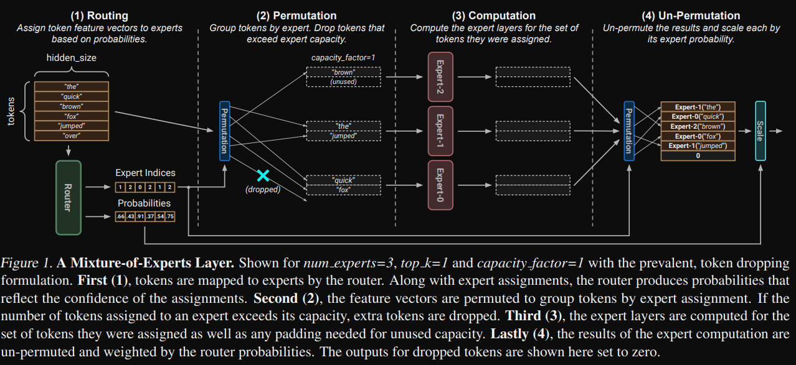

# LLM Pieces - what are language models made of?

## The difference between modern LLMs and their grandparents

The main difference between what we call a language model today and ~10 years ago (in terms of transformer architecture at least) mainly stems from various architecture time and performance focused optimizations, like:
- using only the decoder of the original transformer
- different normalizations
- different attention mechanisms
- different positional encodings
- introducing the Mixture of Experts layer
- different activations

All in all what we have today is not that much different in principle to what was initially discovered by *Ashish Vaswani et all.*

## Understanding the building blocks
The main part of neural networks is that they are made of differentiable blocks, meaning that we have blocks or layers that enable us to both let us calculate the output of the network and then based on the loss function or criterion go back layer by layer in order to adjust the "knobs" of the blocks. These ideas are called the forward and backward pass of models.

### Tokenization - how to change words into numbers
The first step of training our model is tokenization, computers don't understand words, they understand numbers. A naive an simple idea would be to just turn each letter into a number e.g.

Hello world  $\rightarrow$ [H][e][l][l][o][ ][w][o][r][l][d] $\rightarrow$ [0 1 2 2 3 4 5 3 6 2 7]

However this would be wasteful, a much better idea is to use a "proper" tokenizer where each word may have its own number or token or be made of a couple e.g.

Hello world $\rightarrow$ [Hello ][wor][ld] $\rightarrow$ [0 1 2]

This is a much better approach. However, you may ask why would we not just turn each word into a number or token? This is a good question - this is a good idea when our vocabulary is not that rich, however e.g. if we have words `listing walking working ... ` and `listed walked worked ...` it would unnecessarily create a huge list of words that may be just a few letters apart, and the only difference between them is e.g. the tense (present/past/...).

In Radovid a Byte-Pair Encoding (BPE) tokenizer is used, you can take a look at the [Huggingface website](https://huggingface.co/learn/llm-course/en/chapter6/5) to learn more.

### Embedding - from numbers into representations
We have turned text into numbers, but now what? How can a computer know the difference between "dog" and "cat" given that they were turned into numbers e.g. 163 and 22391. This is what embedding is for, we turn the token numbers (indices) into floating point values that represent the idea in some abstract multi-dimentional space.

### Decoder blocks - now the magic happens
#### You can learn about the RMS norm [here](https://github.com/AnthonyP57/Radovid---a-LLM-made-on-a-budget/tree/master/Decoder_only_architecture#normalization-and-rms-norm)
#### RoPE embeddings [here](https://github.com/AnthonyP57/Radovid---a-LLM-made-on-a-budget/tree/master/Decoder_only_architecture/Llama2#rope)
#### Grouped-Query Attention [here](https://github.com/AnthonyP57/Radovid---a-LLM-made-on-a-budget/tree/master/Decoder_only_architecture#multi-query-attention---mqa)
#### Sliding window attention [here](https://github.com/AnthonyP57/Radovid---a-LLM-made-on-a-budget/tree/master/Decoder_only_architecture/Mistral#sliding-window-attention)
#### Rolling buffer cache [here](https://github.com/AnthonyP57/Radovid---a-LLM-made-on-a-budget/tree/master/Decoder_only_architecture/Mistral#kv-cache-with-rolling-buffer-cache)
#### SwiGLU [here](https://github.com/AnthonyP57/Radovid---a-LLM-made-on-a-budget/tree/master/Decoder_only_architecture#swiglu)
#### Mixture of Experts [here](https://github.com/AnthonyP57/Radovid---a-LLM-made-on-a-budget/tree/master/Decoder_only_architecture/Mistral#sparse-mixture-of-experts)
#### BERT models [here](https://github.com/AnthonyP57/Radovid---a-LLM-made-on-a-budget/tree/master/BERT)
#### dropless-MoE (dMoE) [here](https://arxiv.org/abs/2211.15841)
What it means to drop tokens:

