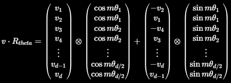

# LLama 2 Architecture

## RoPE
The Embeddings for llama 2 share a common principle - they turn sentences into tokens (usually [BPE](https://huggingface.co/learn/llm-course/en/chapter6/5) tokenizer) and then into values that encode some information.

In llama the embeddding dim is 4096.

Then (in vanilla transformer) we add positional embeddings (they are called absolute possitional embeddings) and then we get the stuff we feed into the network.

In Llama we use RoPE, we also compute them before the calculation of the attention and they are calculated for Q and K only. RoPE are something between absolute and relative embeddings - RoPE were introduced as a way to find an inner product between Q and K that only depends on their relative distance, this is done through Euler's formula (the one when we take the power of e^[x] to get a rotation), so the tokens that are in a similar position are kinda similar.

>[!NOTE]
>inner product is a "generalization" of the dot product

The vanilla rotational metrix is very sparse, so we calculate it as below instead

to get the embedding - where m is the token position and theta is precomputed as a series. We can precompute the matrices with cos and sin as they depend only on position.

The motivation behind complex numbers in the RoPE is that they are used for rotations as Euler's formula says:

$R\cdot e^{ix} = R \cdot \cos (x) + i \cdot \sin (x)$

So we can represent complex numbers in trygonometric forms. We can see this on a "xy-axis" with the real values on the x-axis and imaginary on y-axis.

In order to apply the RoPE to the embeddings we need to do a series of operations:

### 1. reshape from size~(n) to (n/2, 2)

### 2. turn the second value into a complex number

### 3. hadamard product with the precomputed `freqs_complex`

### 4. we then divide the real and imaginary parts

### 5. we then flatten

Finally we get the same thing as with the latex formula above.

## RMS Norm
Instead of layer norm

We calculate RMS Norm

$\text{(Row-wise)} \\ X'_{i,:} = \frac{X_{i,:}}{RMS(X_{i,:})}$

## KV Cache

## GQA

