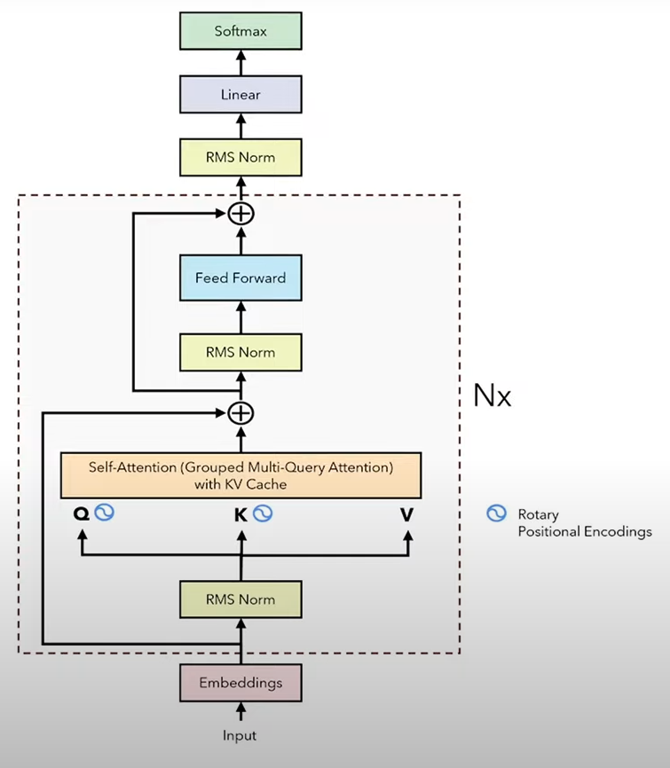
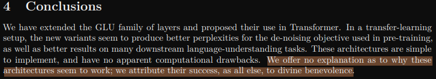

# LLaMa
[^1]Llama is a collection of foundation language models introduced by Meta (former Facebook), they range from 1B to 288B parameters.

## Architectural differences between the vanilla transformer and decoder-only transfromers.
In the original paper the transfromer was made up of encoder and decoder blocks, decoder-only transformers are comprised only from the decoder part (as the name suggests), this comes from the idea that in transformers what we do is we calculate the conditional probability of the next token and it is quite wasteful to have a dedicated encoder for most likely quite "sparse" inputs.

$\text{Originally: } p(x_{t}) = F(x_{:t} ; c_{encoded})$

$\text{Decoder-only: } p(x_{t}) = F(x_{:t}) \text{ where }x\leftarrow [x \mid \mid c]$

<p align="center">
  
</p>
<div align='center'>
<em>Fig.1 Vanilla transformer architecture overview</em>
</div></br>

<p align="center">
  
</p>
<div align='center'>
<em>Fig.2 Decoder-only transformer architecture overview [2]</em>
</div>

In LLaMa also the normalization (RMS Norm) is moved before the attention mechanism and Feed Forward blocks.

### LLaMa 1
LLaMa 1 came in Febuary 2023 with sizes between ~7B to ~63B parameters, and was trained on 1T tokens and sequence length of 2k tokens.

### LLaMa 2
[^3]The context length was around 4k with model sizes varying from ~7B to 70B and introduced GQA (grouped query attention).

## Normalization and RMS Norm
Why we do normalization? - we do this to somehow keep the data from the previous layer passed to the next layer in the same range, so that the layers do not need to change drastically (the phenomenon of drasticly changing the model weights is called the Internal Covariance Shift).
### Layer normalization
$x' = \frac{(x-\mathbb{E}[x])}{\sqrt{\mathbb{Var}([x]) + \epsilon}} \cdot \gamma + \beta$

For each element of the batch we calculate the mean and variance of its feature values and then based on that we normalize ($\gamma$ and $\beta$ are learnable parameters).
### RMS Norm
Llama uses [^4]RMS normalization, the original layer norm has re-centering and re-scaling invariance properties. RMS norm is re-scaling invariant and this property is attributed to its success.

$x' = \frac{x}{RMS(X)}$

The statistic is also calculated for each batch element separately.

```python
class RMSNorm(nn.Module):
    def __init__(self, hidden_size, variance_epsilon=1e-5):
        super().__init__()
        self.weight = nn.Parameter(torch.ones(hidden_size))
        self.eps = variance_epsilon
        self.hidden_size = hidden_size

    def forward(self, x):
        # Assumes x is (batch_size, ..., hidden_size)
        input_dtype = x.dtype
        # Calculate variance in float32 for stability
        variance = x.to(torch.float32).pow(2).mean(-1, keepdim=True)
        x = x * torch.rsqrt(variance + self.eps)

        # Apply weight and convert back to original dtype
        return (self.weight * x).to(input_dtype)
```

Why RMS? - because we calculate less stuff (less computation), and as per the [^4]RMS paper the re-scaling is what we are intrested in.

## Rotary Positional Encoding
Absolute positional encodings are what is used originally and they encode the absolute position of a token in the sentence - meaning that we know its absolute "lattitude" and "longitude"

### Relative positional encodings
We are interested as how two words relate to each other, they deal with 2 tokens at the time. So given two vectors we create a vector that represents their distance.

### Rotary positional embeddings RoPE
RoPE is supposed to encode the relative distance between $Q$ and $K$ that only depends on the two vectors and the relative distance they represent. It is done as

$v' = R_{\theta} \cdot v \text{ where } R_{\theta} = \begin{bmatrix} \cos\theta & -\sin\theta \\\ \sin\theta & \cos\theta \\\ \end{bmatrix} \text{ is a rotation matrix}$

when the vector is not 2-dimentional we need to use a different $R_{\theta}$ but it is very spars. We will do this in a more computatioanlly efficient way:

$m\text{ - position of embedding}$
$v \cdot R_{theta} = \begin{pmatrix} v_1 \\\ v_2 \\\ v_3 \\\ v_4 \\\ \vdots \\\ v_{d-1} \\\ v_d\\\\end{pmatrix} \times \begin{pmatrix} \cos m\theta_1 \\\ \cos m\theta_1 \\\ \cos m\theta_2 \\\ \cos m\theta_2 \\\ \vdots \\\ \cos m\theta_{d/2} \\\ \cos m\theta_{d/2}\end{pmatrix} \times \begin{pmatrix} -v_2 \\\ v_1 \\\ -v_4 \\\ v_3 \\\ \vdots \\\ -v_d \\\ v_{d-1}\end{pmatrix} \times \begin{pmatrix} \sin m\theta_1 \\\ \sin m\theta_1 \\\ \sin m\theta_2 \\\ \sin m\theta_2 \\\ \vdots \\\ \sin m\theta_{d/2} \\\ \sin m\theta_{d/2}\end{pmatrix}$

They are computed once and then we can reuse them. And the relation between two tokens decays as the distance grows (what we want). we do not add anything - we multiply the token embedding by the rotation matrix. The RoPE are applied onlt to the $Q$ and $K$ matrices and after they have been multiplied by $W$, in the vanilla transformer they are applied before.

## Attention - KV cache
Originally the self attention is calculated as

$Att(Q,K,V) = softmax(\frac{Q \times K^T}{\sqrt{d_m}})\times V$

<p align="center">
  
</p>
<div align='center'>
<em>Fig.3 Vanilla attention mechanism [2]</em>
</div>

### Multi-head Attention - MHA
We calculate 

$Q' = Q \times W \text{ or } W^Q$

$K' = K \times W \text{ or } W^K$

$V' = V \times W \text{ or } W^V$

split by the embedding dimention and calculate the attention for each split, then we combine the attentions into a MHA and multiply by $W^o$.

### KV Cache
For training it is not valid, but for inference instead of having to calculate the whole attention matrix we can calculate only the attention for the last query token, as we are only interested in it.

<p align="center">
  
</p>
<div align='center'>
<em>Fig.4 KV Cache [2]</em>
</div>

The KV Cache saves us a lot of computation, which makes the inferencing faster.

## Multi Query Attention - MQA
GPUs are very good at computing stuff fast, however the transfer of data is much slower (approximately 40 times - Nvidia A100), so our goal is to minimize the number of operations and minimize the memory access/transfer that we perform.

In vanilla attention the bottleneck is actually the computation, not the memory. KV Cache minimizes the number of operations performed, so the memory access becomes the bottleneck, that's why we introduce the MQA - we keep thq $Q$ as is, but $K$ and $V$ is shared between them. The performance gains are important while the model quality suffers only a little.

### Grouped Multi Query Attention
Grouped multi query attention is a good compromise between MHA (1:1 correspondence) and MQA (n:1 correspondence).

<p align="center">
  
</p>
<div align='center'>
<em>Fig.5 Different attention mechanisms [2]</em>
</div>

## SwiGLU
[^6]SwiGLU function

$SwiGLU(x, W_1, W_2) = (x W_1 \cdot \sigma(x W_1)) \odot (x W_2) = Swish(x W_q) \odot (x W_2)$

$Swish(z) = z\cdot \sigma(z)$

(Swish is also called SiLU)

```python
import torch
import torch.nn as nn
import torch.nn.functional as F

class SwiGLU(nn.Module):
    def __init__(self, input_dim, hidden_dim):
        super().__init__()
        self.linear1 = nn.Linear(input_dim, hidden_dim)
        self.linear2 = nn.Linear(input_dim, hidden_dim)

    def forward(self, x):
        swish_part = F.silu(self.linear1(x))
        linear_part = self.linear2(x)
        return swish_part * linear_part
```

Why does it work well? - 

<p align="center">
  
</p>
<div align='center'>
<em>Fig.6 Explanation as to why GLU variants work well [6]</em>
</div>

## Disclaimer
> [!CAUTION]
> This repo does not serve to amazingly describe and explain model architectures, it was made to give a broad simplified overview of the models and implement them.

[^1]: Touvron, H., Lavril, T., Izacard, G., Martinet, X., Lachaux, M., Lacroix, T., Rozière, B., Goyal, N., Hambro, E., Azhar, F., Rodriguez, A., Joulin, A., Grave, E., & Lample, G. (2023). LLAMA: Open and Efficient Foundation Language Models. arXiv (Cornell University). https://doi.org/10.48550/arxiv.2302.13971

[^2]: Umar J. (2023). LLaMA explained: KV-Cache, Rotary Positional Embedding, RMS Norm, Grouped Query Attention, SwiGLU https://www.youtube.com/watch?v=Mn_9W1nCFLo&t=3210s&ab_channel=UmarJamil

[^3]: Touvron, H., Martin, L., Stone, K., Albert, P., Almahairi, A., Babaei, Y., Bashlykov, N., Batra, S., Bhargava, P., Bhosale, S., Bikel, D., Blecher, L., Ferrer, C. C., Chen, M., Cucurull, G., Esiobu, D., Fernandes, J., Fu, J., Fu, W., . . . Scialom, T. (2023). Llama 2: Open foundation and Fine-Tuned chat models. arXiv (Cornell University). https://doi.org/10.48550/arxiv.2307.09288

[^4]: Zhang, B., & Sennrich, R. (2019). Root mean square layer normalization. arXiv (Cornell University). https://doi.org/10.48550/arxiv.1910.07467

[^5]: Su, J., Lu, Y., Pan, S., Wen, B., & Liu, Y. (2021). RoFormer: Enhanced Transformer with Rotary Position Embedding. arXiv (Cornell University). https://doi.org/10.48550/arxiv.2104.09864

[^6]: Shazeer, N. (2020). GLU variants improve transformer. arXiv (Cornell University). https://doi.org/10.48550/arxiv.2002.05202