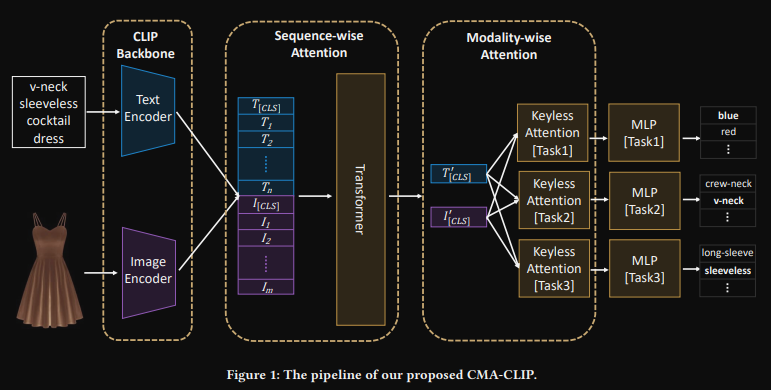

# CMA-CLIP: Cross-Modality Attention CLIP for Image-Text Classification

## Contrastive Language-Image Pre-Training(CLIP)
He have text-image pairs, each text and image goes through respective encoders and then the embeddings are compared in order to either maximize or minimize cosine similarity, depending if the pair contains positive or negative examples. This can be used for zer-shot classification.

## The Cross-Modality Attention CLIP (CMA-CLIP)

(Transformer = Transformer encoder)

Where Keyless Attention is just:

$out = \lambda \cdot CLS_{image} + (1-\lambda) \cdot CLS_{text}$

$e_{image} = W_I \cdot CLS_{image}$

$e_{text} = W_T \cdot CLS_{text}$

and

$\lambda = \frac{e_{image}}{exp(e_{image} + e_{text})}$