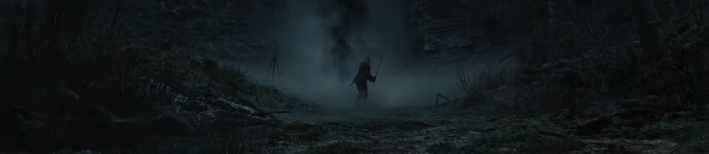
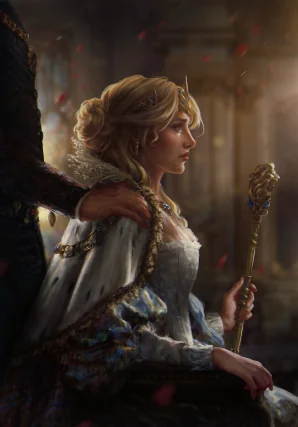
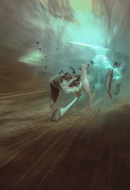

<div style="font-size: 0.9em; color: gray; margin-top: 5px; text-align: right;">
  <em>Ciri from The Witcher 4 trailer</em>
</div>

# Cirilla
<p>
Cirilla is an open source learning project aiming at implmenting various LLMs.
It is focused mainly on showing how to make, train, infer and deploy a LLM from scratch using Pytorch and a budget friendly GPU (RTX 4060Ti 16GiB ~500$).
</p>

## Who is Cirilla
<div style="display: flex; align-items: top; justify-content: space-between;">

  <div style="text-align: center; margin-right: 25px;">
    
    <div style="font-size: 0.9em; color: gray; margin-top: 5px;">
      <em>Fig.1 Ciri Gwent card by Bogna Gawrońska</em>
    </div>
  </div>

  <div style="flex: 1; padding: 25px; text-align: left;">
    <p>
      <strong>Cirilla Fiona Elen Riannon</strong>, known as <em>Ciri</em>, is one of the central characters in 
      <em>The Witcher</em> saga by Andrzej Sapkowski and its adaptations.  
      She is the princess of Cintra, granddaughter of Queen Calanthe, and the sole heir 
      to a powerful lineage marked by the mysterious Elder Blood.<br><br>Ciri is defined by her destiny, adaptability, and potential. Unlike kings who wield authority by birthright, her strength comes from surviving chaos, learning from mentors like Geralt and Yennefer, and unlocking extraordinary powers.<br><br>Her unique abilities make her one of the most pivotal figures in the saga. Known as the <em>Lady of Space and Time</em>, the <em>Lion Cub of Cintra</em>, and the <em>Child of the Elder Blood</em>, she can manipulate space and time, travel between worlds, and influence the course of events in ways few can.
    </p>
  </div>

</div>

## Why name a LLM Cirilla
<div style="display: flex; align-items: top; justify-content: space-between;">

  <div style="flex: 1; padding: 25px; text-align: righty;">
    <p>
      Unlike rulers who inherit authority, <em>Cirilla</em> embodies potential realized through learning, experience, and adaptability. She is resilient, capable of navigating complex and unpredictable worlds, and able to respond to challenges with skill and precision - qualities that mirror how an language model can shift between tasks, domains, and contexts.<br><br>Guided by mentors and shaped by hardships, Ciri develops her abilities quickly, mastering both strategy and instinct while remaining flexible in the face of unforeseen circumstances.<br><br>Her combination of innate talent, adaptability, and the capacity for growth makes her an fitting symbol for a language model designed to acquire knowledge, evolve over time, and connect information across domains.
    </p>
  </div>

  <div style="text-align: center; margin-right: 25px;">
    
    <div style="font-size: 0.9em; color: gray; margin-top: 5px;">
      <em>Fig.2 Ciri Gwent card by Anna Podedworna</em>
    </div>
  </div>

</div>

## What is a LLM
On a high level: imagine a toddler with an huge amount of knowledge but still possessing a toddler-like way of reasoning and understanding.

On a lower level: an LLM is a neural network trained on so-called big data to recognize patterns, generate human-like responses, and predict the most likely next word in a given context. While it can process and recall information efficiently, it lacks true understanding, reasoning, or consciousness, relying only on statistical correlations rather than genuine comprehension. the reasoning of LLMs is being impoved in projects (most notably) like DeepSeek, which focus on enhancing the ability to understand context and simulating human-like reasoning.

## Repo organization:
```bash
Cirilla - a LLM made on a budget/
  │
  ├── BERT/                           # overview of BERT
  │   └── RAG/                        # overview of RAG
  │
  ├── Cirilla_model/                  # implementation of Cirilla LLM
  │   ├── model.py
  │   ...
  │
  ├── Decoder_only_architecture/      # overview of decoder only transformer architecture
  │   └── Llama2/                     # implementation of Llama 2 inference loop
  │   └── Mistral/                    # overview of the Mistral 7B architecture and inference tricks
  │
  ├── LLM_pieces/                     # elements of decoder-only model you can use
  │   ├── SMoE.py                     # Sparse mixture of Experts
  │   ...
  │
  ├── Synth_data/
  │   ├── fandom_create_instruct.py   # create the so-called instructions from fandom data
  │   ├── fandom_scraper.py           # scrape the data based on the witcher_json/
  │   ├── Ollama_create_instruct.py   # based on the fandom data create instructions with LLMs
  │   ├── reason_gym_synthetic.py     # with reasoning gym create synthetic data
  │   └── rm_duplicate_instruct.py    # remove duplicate instructions from Ollama
  │
  ├── Training_optimizations/
  │   ├──FlexAttention/               # overview of Pytorch's FlexAttention
  │   └── HF_kernels/                 # overview of HF's kernel hub
  │     └── examples/
  │
  └── Transformer_from_scratch/       # transformer implementation
      ├── model.py                    # transformer model
      ├── dataset.py                  # dataset for MLM - masked language modelling
      ├── train.py                    # main transformer training loop
      └── LongNet.py                  # LongNet - crude dilated attention implementation
```