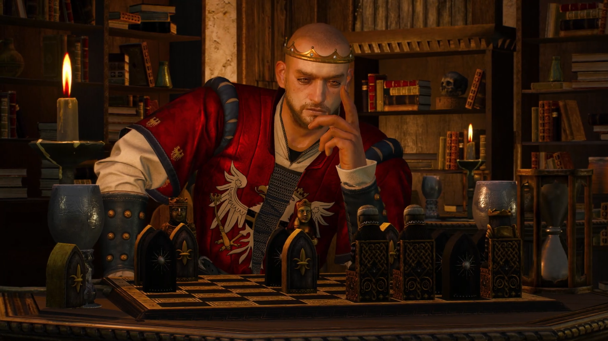

<pre>
 ______   ______   _____    ______   __   __ __   _____    
/\  == \ /\  __ \ /\  __-. /\  __ \ /\ \ / //\ \ /\  __-.  
\ \  __< \ \  __ \\ \ \/\ \\ \ \/\ \\ \ \'/ \ \ \\ \ \/\ \ 
 \ \_\ \_\\ \_\ \_\\ \____- \ \_____\\ \__|  \ \_\\ \____- 
  \/_/ /_/ \/_/\/_/ \/____/  \/_____/ \/_/    \/_/ \/____/ 
                                                           
</pre>

# Radovid
Radovid is an open source learning project aiming at implmenting various LLMs.
It is focused mainly on showing how to make, train, infer and deploy a LLM from scratch using Pytorch and a budget friendly GPU (RTX 4060Ti 16GiB ~500$).
## Who is Radovid
Radovid V is a fictional character in The Witcher franchise, appearing in both the books by Andrzej Sapkowski and their adaptations, including The Witcher video games by CD Projekt Red. He was the King of Redania, a powerful and wealthy kingdom in the Witcher universe. Radovid was an ambitious ruler who often showed no mercy to those he deemed enemies. His reign was marked mainly by warfare and relentless crusade against magic, particularly the mages and sorceresses whom he viewed as a threat to his rule. Over time, his paranoia and obsession with power led to increasingly brutal and oppressive measures, earning him both fear and infamy across the Northern Kingdoms.

<p align="center">
  
</p>

<div align='center'>
  <em>Fig.1 "King Radovid Tortures Philippa Eilhart" by Nemanja Stankovic - Gwent leader card</em>
</div>
</br>

### Why name a LLM Radovid
Despite his brutality, Radovid was an intelligent, strategic, and highly perceptive ruler. He possessed a sharp mind, allowing him to anticipate threats, manipulate alliances, and outmaneuver his enemies with great precision. His ability to gather and use information to his advantage made him one of the most prominent leaders in The Witcher universe.

<p align="center">
  
</p>

<div align='center'>
<em>Fig.2 Radovid chess scene - The Witcher 3: Wild Hunt</em>
</div>
</br>

## What is a LLM
On a high level: imagine a toddler with an huge amount of knowledge but still possessing a toddler-like way of reasoning and understanding.

On a lower level: an LLM is a neural network trained on so-called big data to recognize patterns, generate human-like responses, and predict the most likely next word in a given context. While it can process and recall information efficiently, it lacks true understanding, reasoning, or consciousness, relying only on statistical correlations rather than genuine comprehension. the reasoning of LLMs is being impoved in projects (most notably) like DeepSeek, which focus on enhancing the ability to understand context and simulating human-like reasoning.

## Repo organization:
```bash
Radovid - a LLM made on a budget/
    │
    ├── BERT/                       # overview of BERT    
    │
    ├── Decoder_only_architecture/  # overview of decoder only transformer architecture
    │   └── Llama2/                 # implementation of Llama 2 inference loop
    │
    ├── FlexAttention/              # overview of Pytorch's FlexAttention
    │
    ├── HF_kernels/                 # overview of HF's kernel hub
    │   └── examples/
    │
    ├── Transformer_from_scratch/   # transformer implementation
    │   ├── model.py                # transformer model
    │   ├── dataset.py              # dataset for MLM - masked language modelling
    │   ├── train.py                # main transformer training loop
    │   └── LongNet.py              # LongNet - crude dilated attention implementation
    │
    │── witcher_fandom/
    │   ├── scraped data from https://witcher.fandom.com/wiki/Witcher_Wiki
    │   ...
    │
    │── witcher_instruct/
    │   ├── so-called instructions regarding the Witcher, gathered from fandom
    │   ...
    │
    │── witcher_json/
    │   ├── json of what data to scrape from fandom
    │   ...
    │
    │── witcher_synthetic_instruct/
    │   ├── clean.jsonl             # Witcher instructions created with LLMs
    │   ├── reason_gym_synth.jsonl  # Reasoning dataset created with reasoning_gym
    │   ...
    │
    │── fandom_create_instruct.py   # create the so-called instructions from fandom data
    │── fandom_scraper.py           # scrape the data based on the witcher_json/
    │── Ollama_create_instruct.py   # based on the fandom data create instructions with LLMs
    │── reason_gym_synthetic.py     # with reasoning gym create synthetic data
    └── rm_duplicate_instruct.py    # remove duplicate instructions from Ollama
```