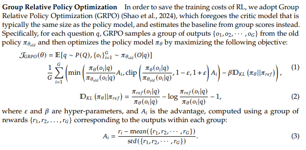

#  Group Relative Policy Optimization (GRPO)
GRPO was created by DeepSeek in order to increase reasoning capabilities without supervised data.

For DPO we have directly the "better" response, however in the case of GRPO we generate a couple of answers for a given query.

## Policy Gradient Optimization
Policy gradient is the trace of the path we should take to maximize the reward, however the search space may be enormous. It is intractable, so we want to limit the search space - we can do this by introducing an advantage term i.e. how "better" it would be to choose some word over some other random words in GRPO this is the $A_i$. In LLMs we need to sample some resposens, grade them and so on, this is expensive - that's why we introduce off-policy learning - we ask a model to generate responses, then we sample some of these responses and use them instead of generating all the time, then when we run out we generate more responses for a given query database.