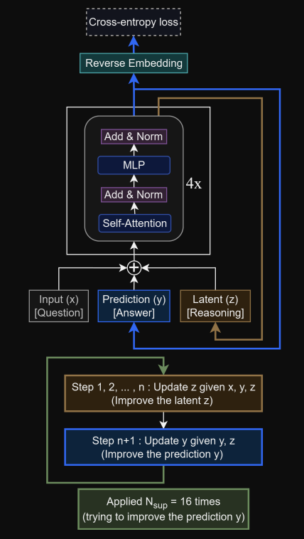

# Less is More: Recursive Reasoning with Tiny Networks

<p align="center">
  
</p>

## Why Tiny Recursive Models (TRM)
[^1] [^2] [^3] [^4]Tiny Recursive Models (TRM) are based on Hiererchical Reasoning Models (HRM), HRMs generally speaking were created to mimic how the (mouse) brain works i.e. There are various regions in the cortex that correspond to different "thought processes" and have different importance, for simplicity let's assume that we have some sort of $\text{lower level thought process}$ $L_net$ and $\text{higher level thought process}$ $H_net$ we can then define HRM as:

```python
def hrm(z, x, n=2, T=2): # hierarchical reasoning
    zH, zL = z

    with torch.no grad():

        for i in range(nT − 2):
            zL = L_net(zL, zH, x)
            if (i + 1) % T == 0:
                zH = H_net(zH, zL)

    # 1−step grad
    zL = L_net(zL, zH, x)
    zH = H_net(zH, zL)

    return (zH, zL), output_head(zH), Q_head(zH)

def ACT_halt(q, y_hat, y_true):
    target_halt = (y_hat == y_true)
    loss = 0.5∗binary_cross_entropy(q[0], target_halt)
    return loss

def ACT_continue(q, last_step):
    if last_step:
        target_continue = sigmoid(q[0])
    else:
        target_continue = sigmoid(max(q[0], q[1]))
        loss = 0.5∗binary_cross_entropy(q[1], target_continue)
    return loss

# Deep Supervision
for x_input, y_true in train dataloader:
    z = z init
    for step in range(N sup): # deep supervision
        x = input_embedding(x_input)
        z, y_pred, q = hrm(z, x)

        loss = softmax_cross_entropy(y_pred, y_true)

        # Adaptive computational time (ACT) using Q−learning
        loss += ACT_halt(q, y_pred, y_true)
        , , q_next = hrm(z, x) # extra forward pass
        loss += ACT_continue(q_next, step == N_sup − 1)

        z = z.detach()
        loss.backward()
        opt.step()
        opt.zero_grad()

        if q[0] > q:
            break
```

There is a couple of problems with this approach, namely:
- Implicit Function Theorem (IFT) - basically, we assume that backpropagating through only the last step is enough to approximate the whole gradient, however this approximation is based that the residuals will approach 0 and approach some fixed point, this is not exactly true. In TRM we run the whole recursion process one last time, not only the $L\_net$ and $H\_net$, which is supposed to bring us closer to the true approximation of the gradient. (e.g. We do 5 x ($L\_net$ x 2, $H\_net$) without gradient and then ($L\_net$ x 2, $H\_net$) instead of just ($L\_net$, $H\_net$) as in HRM)
- extra forward pass to calculate the Adaptive computational time (ACT) continue
- Hierarchical interpretation based on the complex biological arguments

TRM improvements over the HRM:
- "fixes" in the IFT
- using only a single network for both $L\_net$ and $H\_net$
- simple (small) model
- attention free architecture for small sequences
- no additional forward pass for ACT
- Exponential Moving Average (EMA) of the weights

TRM pseudocode:

```python
def latent_recursion(x, y, z, n=6):
    for i in range(n): # latent reasoning
        z = net(x, y, z)

    y = net(y, z) # refine output answer
    return y, z

def deep_recursion(x, y, z, n=6, T=3):
    # recursing T−1 times to improve y and z (no gradients needed)
    with torch.no grad():
        for j in range(T−1):
        y, z = latent_recursion(x, y, z, n)

    # recursing once to improve y and z
    y, z = latent_recursion(x, y, z, n)
    return (y.detach(), z.detach()), output_head(y), Q_head(y)

# Deep Supervision
for x_input, y_true in train dataloader:
    y, z = y_init, z_init
    for step in range(N supervision):
        x = input_embedding(x_input)
        (y, z), y_hat, q_hat = deep_recursion(x, y, z)
        loss = softmax_cross_entropy(y_hat, y_true)
        loss += binary_cross_entropy(q_hat, (y_hat == y_true))
        loss.backward()
        opt.step()
        opt.zero grad()
        if q_hat > 0: # early−stopping
            break
```

## Disclaimer
> [!CAUTION]
> This repo does not serve to amazingly describe and explain model architectures, it was made to give a broad simplified overview of the models and implement them.

[^1]: Jolicoeur-Martineau, A. (2025). Less is More: Recursive Reasoning with Tiny Networks. arXiv (Cornell University). https://doi.org/10.48550/arxiv.2510.04871

[^2]: Wang Guan et al. (2025).Hierarchical Reasoning Model. https://doi.org/10.48550/arXiv.2506.21734

[^3]: lucidrains / tiny-recursive-model https://github.com/lucidrains/tiny-recursive-model

[^4]: SamsungSAILMontreal / TinyRecursiveModels https://github.com/lucidrains/tiny-recursive-model
