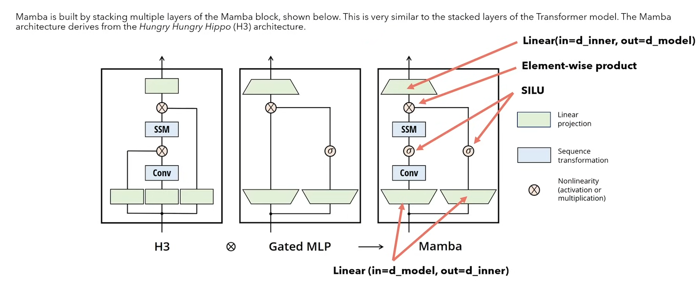
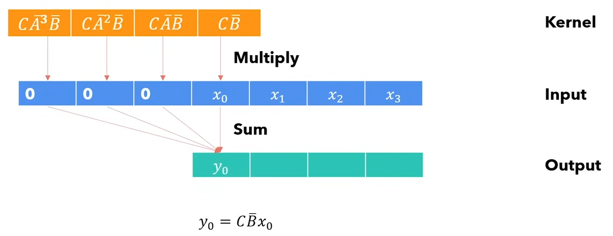
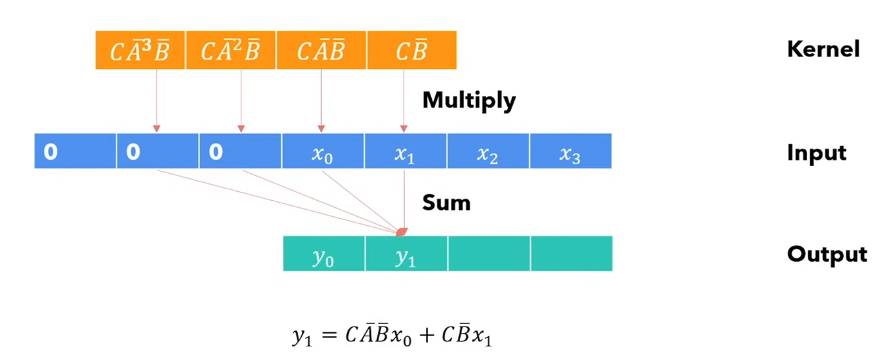
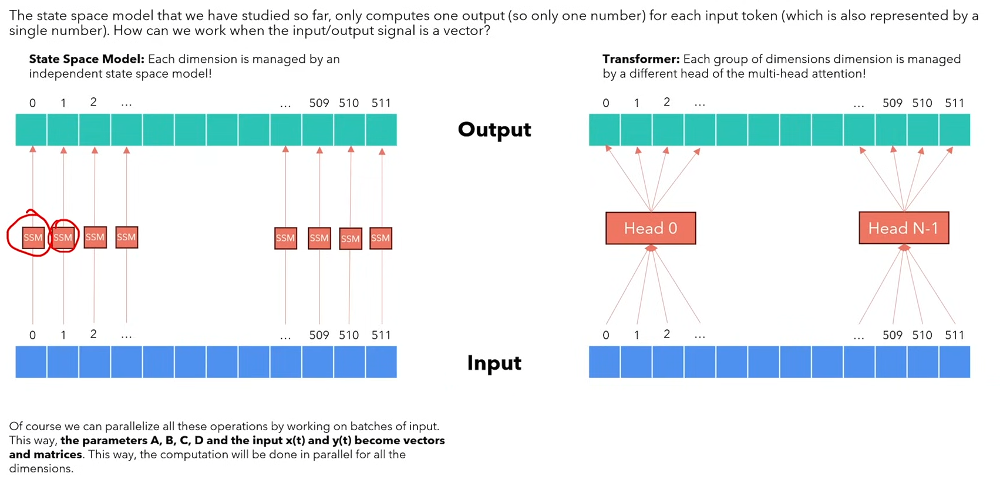
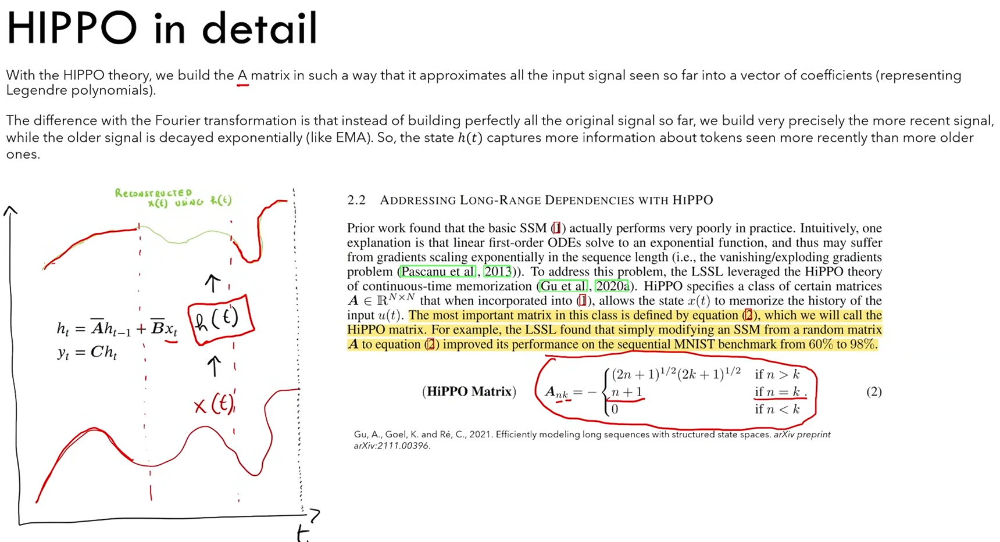
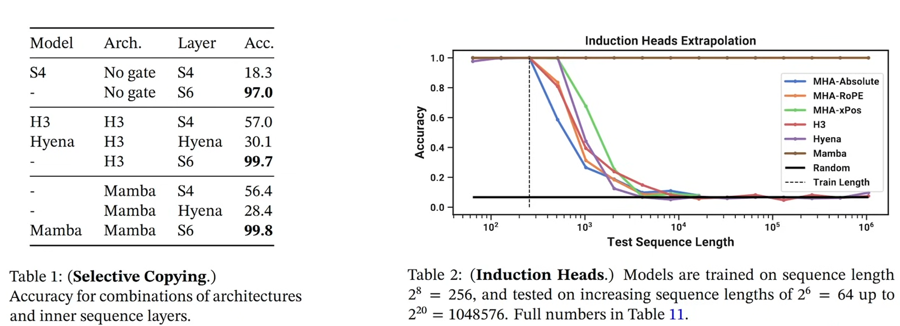

# Mamba

## Stace space model (SSM)
### Sequence modelling
We map an input sequence into an output sequence e.g. RNN

Some models can be used for that, however:
- RNNS are not parallelizable, suffer from vanishing/exploding gradients, in theory infinite context length, training in O(n)
- CNN has a finite context window, easily parallelizable
- Transformers training is O(n^2), inference with KV-cache is O(n) for each token, this is not optimal, especially for very long inputs for both inference and training, this model is easily parallelizable

A perfect model would allow us to:
- parallelize training (like transfomer)
- scale linearly to long sequences like RNN
- run inference at O(1)

### SSM
Allow to map an input signal into x(t) (of time) and output signal y(t) by means of a state representation h(t)

$h'(t) = Ah(t) + Bx(t)$

$y(t) = Ch(t) + Dx(t)$

This model is linear and time invariant, because the parameters (A, B, C, D) don't depend on time. But first we need to find the funcion $h(t)$, but that can be hard to solve analytically, we can approximate by discrecitizing. We can approximate this with Euler's method:

$h'(t) = \lambda h(t)$

we can approzimae that $h(t + \Delta) \approx h'(t) \cdot \Delta + h(t)$

We can replace $h(t + \Delta) \approx \lambda h(t) \cdot \Delta + h(t)$

We can then do $h(t + \Delta) \approx (Ah(t) + Bx(t)) \cdot \Delta + h(t) = (I + \Delta A)h(t) + \Delta B x(t) = \bar{A}h(t) + \bar{B} x(t)$ where $I$ is the identity matrix

So:

$h_t = \bar{A}h_{t-1} + \bar{B}x_t$

$y_t = Ch_t$

and $\Delta$ will be a trainable parameter

This is smilar to an RNN, recurrent computation is great for inference but terrible for training, because we cannot parallelize.

However we can note that:

$y_k = C \bar{A}^k \bar{B}x_0 + C \bar{A}^{k-1} \bar{B}x_1 + ... + C \bar{A} \bar{B}x_{k-1} + C \bar{B}x_k$

This is similar to a convolution with kernel $\bar{K} = (C\bar{B}, C\bar{A}\bar{B}, ..., C\bar{A}^kB, ...)$

$y = x \cdot \bar{K}$

(Here the kernel is inverted but that doesn't change anything in computation)

This can be parallelized easily, but we need to build the kernel, which may be expensive, but also for inference we have O(1) ince this is a convolution.

We may not that previously we had:

$y(t) = Ch(t) + Dx(t)$

but we wrote just now

$y_t = Ch_t$

The D can be thought of as a skip connection, as is does not depend on the state of the system.

$x \rightarrow SSM \rightarrow Y$

$\quad \searrow D \nearrow$

Ok, but how can we go from scalar to vector, we can use a separate SSM for each dimension independently. This may look strange but this is similar to a multi head attention.

The $\bar{A}$ matrix can be thought of as a matrix that captures the previous state information, it catches all the history, so we need to be very careful about it, as in next token generation we depend on it. For that they used the HIPPO theory (this is something similar to a Fourier transform).

## Mamba
Vanilla SSM has a problem for tasks with selective copying i.e. if we would like to copy a comment but ignore offensive words, this will be a problem and induction (reasoning) is also a problem. Because of that Mamba was created. Mamba is also called a S6 model, and SSM is S4. Mamaba has consistent performance for even long sequences.

### GPU has 2 types of memory
#### DRAM
High bandwidth memory (in GiBs)

#### SRAM
Much faster but smaller (in MiBs). This is where the GPU does the computation

Sometimes our models may be slow because we are copying stuff to and from memory (IO-bound).

In Mamba it is used for more efficient computations: kernel fusion (doing computation in SRAM), recomputation (for bigger tensors it may be faster to just recompute them rather than moving them to and from memory)