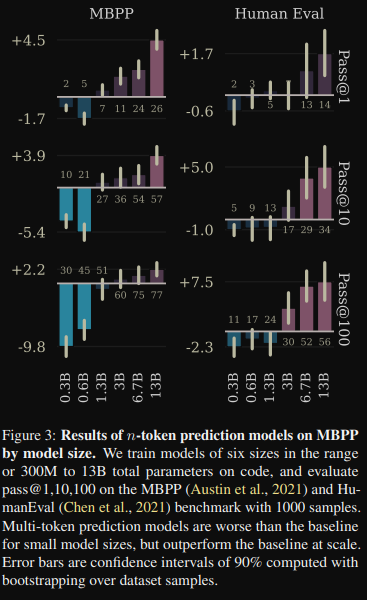
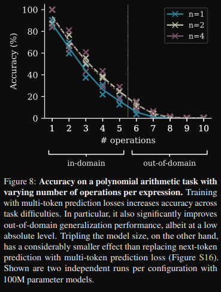
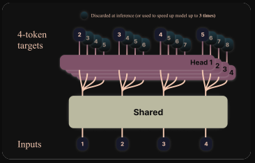
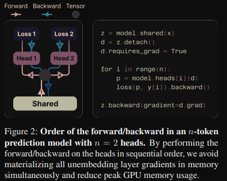
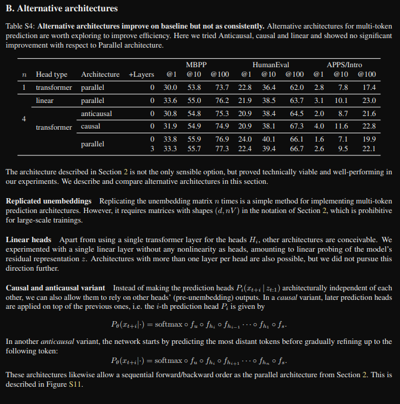

# [^1]Multi-token Prediction (MTP)
## Why?
For better training data utilization

## When does it work?
### "Normal" NLP
Works for models > 7B

### Induction capability
Models 1M to 1B are better at inducing information from text, the better information induction may translate into poorer results on "normal" NLP tasks as a consequence of having to translate the induction into a locally solveable text-specific task.

### Algorithmic reasoning
For models 30M to 100M MTP gives better results

## Implementation details
We use a transformer "encoding trunk" on $x$ to get text representation $z$, then with multiple prediction heads $f_{head_i}$(being of transformer architecture as well) and a shared output weight we get predictions for respectively shifted tokens $y_i$

$Loss = - \sum_t log \space P_{\theta}(x_{t+n:t+1} \vert z_{t:1}) \cdot P_{\theta}(x_{t:1} \vert x_{t:1}) = - \sum_t \sum_i^n log \space P_{\theta}(x_{t+i} \vert z_{t:1}) \cdot P_{\theta}(x_{t:1} \vert x_{t:1})$

$P_{\theta}(x_{t+i} \vert x_{t:1}) = softmax(f_{out}(f_{head_i}(f_{enc}(x_{t:1}))))$

This naively may require big VRAM overhead, however this can be simplified with:

### Alternative architectures

## Disclaimer
> [!CAUTION]
> This repo does not serve to amazingly describe and explain model architectures, it was made to give a broad simplified overview of the models and implement them.

[^1]: Gloeckle, F., Idrissi, B. Y., Rozière, B., Lopez-Paz, D., & Synnaeve, G. (2024). Better & Faster Large Language Models via Multi-token Prediction. arXiv (Cornell University). https://doi.org/10.48550/arxiv.2404.19737
