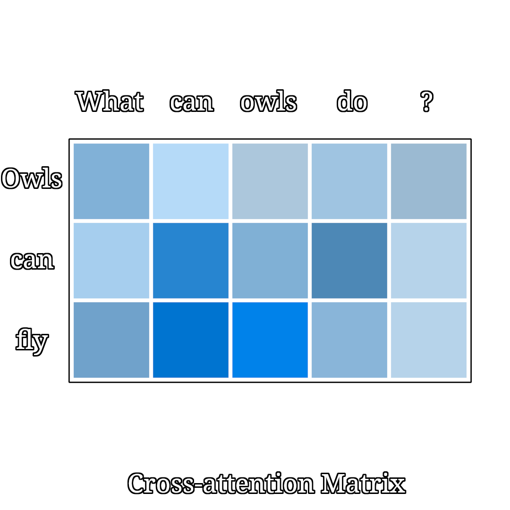
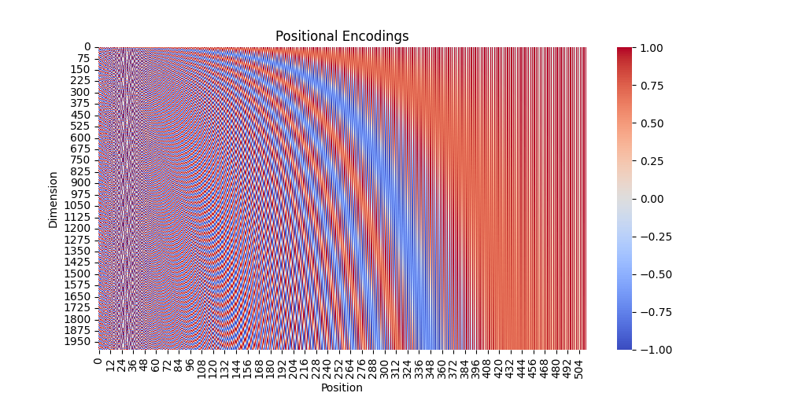

# Attention is all you need

## What is a transformer
[^1] Transformer is a model architecture presented initially for transduction problems — like translation — that resolves one of the big problems of sequential information, meaning sequence length and the lack of parallelization possibility.

### Architecture overview

<p align="center">
  
</p>

<div align='center'>
<em>Fig.1 Transformer architecture overview [1]</em>
</div>

## Previous SOTA
Previous established approaches mainly focused on using recurrent neural networks, they generate a sequence of hidden state _h<sub>t</sub>_ based on the previous hidden states _h<sub>t-1</sub>_. This is what precludes parallelization — the fact that we need to go through each sequence step one by one.

## What is different
Transformers rely on attention rather than seqential processing. Meaning that we are able to process the whole sequence as one time step _O(1)_ instead of n-time steps _O(n)_.

### Attention
As explaned in [^2] let _x = (sequence length vector)<sup>T</sup>_ denote a sequence of inputs and let _q_ be a query (a vector representation of the query) e.g. the RNN hidden state of the target encoder, and _z_ represents the source position we want to attend to. Our aim is to produce context _c_ based on the sequence and the query, we do this by assuming _attention distribution_ _z~p(z | x,q)_, so the context over a sequence will be the expectation _c=E<sub>z~p(z | x,q)</sub>[f(x,z)]_, where f(x,z) in an annotation function. In the context of deep/neural networks both _annotation function_ and _attention distibution_ are parametrized. In that case our _attention distribution_ could be simply _p(z=i | x,q) = softmax(MLP([x<sub>i</sub> ; q]))_, which gives us:
<div align='center'>
<em>c = E<sub>z~p(z | x,q)</sub>[f(x,z)] = Σ p(z | x,q)x<sub>i</sub> = Σ softmax(MLP([x<sub>i</sub> ; q]))x<sub>i</sub></em>
</div>
</br>
Which with the same general logic can be expressed as "Scaled Dot-Product Attention" in the transformer architecture [^1].

</br>
<div align='center'>
<em>Attention(Q,K,V) = softmax( QK<sup>T</sup> / sqrt(d<sub>k</sub> )) V</em>
</div>
</br>
Reffered to later as attention / self-attention / cross-attention. The idea of attention is best explained with a cross-attention visualization for the example inputs: What can owls do? - Owls can fly, here the input would be the question "What can owls do?" (K and V - encoder output) and expected output "Owls can fly" (Q - decoder input), so the attention can be visualized with <em>softmax( QK<sup>T</sup> / sqrt(d<sub>k</sub> ))</em>

<p align="center">
  
</p>

<div align='center'>
<em>Fig.2 Corss-attention visualization — brigther colors denote higher attention/importance</em>
</div>

## How to encode seqential information without sequential processing
The model so far — while good at finding important dependencies through attention — doesn't retain any information about the order of the sentence, this information is "injected" with _positional encodings_. In the original paper [^1] sine and cosine functions are used [^3]:
<div align='center'>
<em>even positions: PE<sub>(pos, 2i)</sub> = sin(pos/1000<sup>2i / d<sub>model</sub></sup>)</em>
</br>
<em>odd positions: PE<sub>(pos, 2i+1)</sub> = cos(pos/1000<sup>2i / d<sub>model</sub></sup>)</em>
</div>
</br>

<p align="center">
  
</p>

<div align='center'>
<em>Fig.3 Positional Encodings visualization</em>
</div>

## Tweaks for numerical stability
Some parts of the model in the implementation may differ to what has been originally presented. Namely it is the positional encodings and the order of normalization, both of those changes have been made to speed up convergence of the model

### Different embeddings
#### Original formula
```python
pe = torch.zeros(max_seq_len, d_model)
position = torch.arange(0, max_seq_len, dtype=torch.float).unsqueeze(1)
div_term = torch.arange(0, d_model, 2).float()
div_term = torch.pow(10000, -div_term / d_model)

pe[:, 0::2] = torch.sin(position * div_term)
pe[:, 1::2] = torch.cos(position * div_term)
```
<p align="center">
  
</p>

<div align='center'>
<em>Fig.4 Original Positional Encodings visualization (flipped axis)</em>
</div>

#### Tweaked formula

```python
pe = torch.zeros(max_seq_len, d_model)
position = torch.arange(0, max_seq_len, dtype=torch.float).unsqueeze(1)
iv_term = torch.exp(torch.arange(0, d_model, 2).float() * (-math.log(10000.0) / d_model))

pe[:, 0::2] = torch.sin(position * div_term)
pe[:, 1::2] = torch.cos(position * div_term)
```
<p align="center">
  
</p>

<div align='center'>
<em>Fig.5 Tweaked Positional Encodings visualization (flipped axis)</em>
</div>
</br>
The difference in the embedding values is minimal but the loss decreases much faster.

## Task - masked language modelling

The task is simeple, fill in the masked sentence e.g.
```
INPUT: Well, [MASK] course!                                                                                          
EXPECTED: Well, of course! 
```
Fill-in-the-mask is a task used to help LLMs understand context, sentence structure, and word relationships. It works by hiding certain words in a sentence and asking the model to predict the missing words based on the surrounding text.


## Results
First decent results appeared at around epoch 2
```
INPUT: He evidently found it hard to decide what [MASK] say [MASK] to [MASK] 'Do you see...' he pointed to a bundle of iron rods tied together with string, in a corner of the room.

EXPECTED: He evidently found it hard to decide what to say and to do . ' Do you see ...' he pointed to a bundle of iron rods tied together with string , in a corner of the room .

PREDICTED GREEDY SEARCH: He evidently found it hard to decide what he say to be to a ' Do you see ...' he pointed to a physician of iron tied together with string , in a corner of the room . 
```
At epoch 3 we can clearly see that the model learnt sentence context
```
INPUT: "I never see [MASK] doing any work there," [MASK] Harris, "whenever [MASK] go in.  

EXPECTED: " I never see him doing any work there ," continued Harris , " whenever I go in .

PREDICTED GREEDY SEARCH: " I never see you doing any work there ," said Harris , " whenever you go .    
```
Epoch 4+ yield similar and better results, so there is no point in continuing

## Mistakes to learn from
- it is better to not overwrite the forward function, instead call the respective things in the model
- too big batch may cause either not enough parameter updates or may create a model that is too good at generalizing, meaning it may only return the most frequent tokens (speculation)
- hiding the mask token in attention may cause the model to disregard the need to fill the mask completely (also speculation)

# LongNet
This part is dedicated to LongNet's dilated attention [^4]. The general principle of dilated attention is that the attention allocation decreases exponentially as the distance between tokens grows.

## Why dilated attention
To handle very long sequences we would need to use RNNs, however they are sequential and hard to parallelize. To perform quick long sequence calculation we would need to modify the original attention mechanism to be much faster — we could do that with state space models that operate as a CNN during training and transform to a RNN at inference, they perform well at long ranges but their performance at regular lengths is poor. Sparse attention reduces compute for attention-based models but preserves the recall capability, to further enchance it dilated attention was created.

## Time complexity
- regular dot product attention requires to compute for N columns and N rows d<sub>model</sub> dot products, giving it the time complexity: O(N<sup>2</sup>d<sub>model</sub>) Fig.2
- sparse attention has (depending on implementation) O(N<sup>3/2</sup>d<sub>model</sub>) time complexity Fig.6 [^5]
- dilated attention presented in the paper requires only O(Nd<sub>model</sub>) operation and retains O(Log N) token dependency (token distance in steps) Fig. 7 [^4]

</br>
<p align="center">
  
</p>

<div align='center'>
<em>Fig.6 Example sparse attention matrices</em>
</div>
</br>
</br>

<p align="center">
  
</p>

<div align='center'>
<em>Fig.7 Example dilated attention and how it is calculated</em>
</div>
</br>

## Why is it better and how
We could naively think that since we would apply a mask to the attention the number of operations doesn't decrease, however the dilated attention does not apply a mask, instead it is calculated as a sparse matrix multiplication.
However the memory constraint is still a problem and can be solved with:
- model parallelizm
- sequence parallelizm
- pipeline parallelizm

None of which will be implemented here but only discussed later (due to lack of multiple GPUs)

For more info on sparse matmul acceleration see:

https://developer.nvidia.com/blog/accelerating-matrix-multiplication-with-block-sparse-format-and-nvidia-tensor-cores/


## Disclaimer
> [!CAUTION]
> This repo does not serve to amazingly describe and explain model architectures, it was made to give a broad simplified overview of the models and implement them.

[^1]: Vaswani, A., Shazeer, N., Parmar, N., Uszkoreit, J., Jones, L., Gomez, A. N., Kaiser, L., & Polosukhin, I. (2017). Attention is All you Need. arXiv (Cornell University), 30, 5998–6008. https://arxiv.org/pdf/1706.03762v5


[^2]: Kim, Y., Denton, C., Hoang, L., & Rush, A. M. (2017). Structured attention networks. arXiv (Cornell University). https://arxiv.org/pdf/1702.00887


[^3]: Donkwan Kim. https://dongkwan-kim.github.io/blogs/a-short-history-of-positional-encoding/

[^4]: Ding, J., Ma, S., Dong, L., Zhang, X., Huang, S., Wang, W., & Wei, F. (2023). LongNet: Scaling Transformers to 1,000,000,000 tokens. arXiv (Cornell University). https://doi.org/10.48550/arxiv.2307.02486

[^5]: Sun, Y., Hu, W., Liu, F., Huang, F., & Wang, Y. (2022). SSA: a Content-Based sparse attention Mechanism. In Lecture notes in computer science (pp. 669–680). https://doi.org/10.1007/978-3-031-10989-8_53